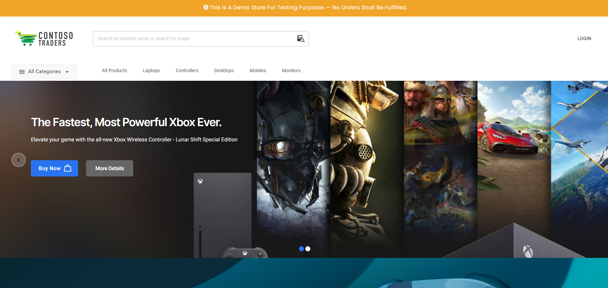

# Contoso Traders - Cloud testing tools demo app

The Contoso Traders app is a sample application showcasing [Playwright](https://playwright.dev), [Azure Load Testing](https://aka.ms/malt-docs), [Azure Chaos Studio](https://aka.ms/CHAOS-docs) and more.

This repo contains the source code, deployment templates, and demo scripts for exploring these cloud testing tools. The Contoso Traders app is here: ADD.

## Documentation and Resources

* Application Links: [UI](https://cloudtesting.contosotraders.com/) | [Carts API](https://contoso-traders-cartscldprd.livelygrass-74d6f26a.eastus.azurecontainerapps.io/swagger/index.html) | [Products API](https://contoso-traders-productscldprd.eastus.cloudapp.azure.com/swagger/index.html)
* [Deployment Instructions](./docs/deployment-instructions.md) | [Running Locally](./docs/running-locally.md)

## Demo Scripts

* [Developer Workflow](./demo-scripts/dev-workflow/walkthrough.md)
* [Azure Load Testing](./demo-scripts/azure-load-testing/walkthrough.md)
  * [Load Testing Private Endpoints](./demo-scripts/azure-load-testing/private-endpoints.md)
* [Azure Chaos Studio](./demo-scripts/azure-chaos-studio/walkthrough.md)
* [Testing With Playwright](./demo-scripts/testing-with-playwright/walkthrough.md)

## Architecture

## Contributing

This project welcomes contributions and suggestions.  Most contributions require you to agree to a
Contributor License Agreement (CLA) declaring that you have the right to, and actually do, grant us
the rights to use your contribution. For details, visit https://cla.opensource.microsoft.com.

When you submit a pull request, a CLA bot will automatically determine whether you need to provide
a CLA and decorate the PR appropriately (e.g., status check, comment). Simply follow the instructions
provided by the bot. You will only need to do this once across all repos using our CLA.

This project has adopted the [Microsoft Open Source Code of Conduct](https://opensource.microsoft.com/codeofconduct/).
For more information see the [Code of Conduct FAQ](https://opensource.microsoft.com/codeofconduct/faq/) or
contact [opencode@microsoft.com](mailto:opencode@microsoft.com) with any additional questions or comments.

## Trademarks

This project may contain trademarks or logos for projects, products, or services. Authorized use of Microsoft
trademarks or logos is subject to and must follow [Microsoft's Trademark & Brand Guidelines](https://www.microsoft.com/legal/intellectualproperty/trademarks/usage/general).
Use of Microsoft trademarks or logos in modified versions of this project must not cause confusion or imply Microsoft sponsorship.
Any use of third-party trademarks or logos are subject to those third-party's policies.

----------

