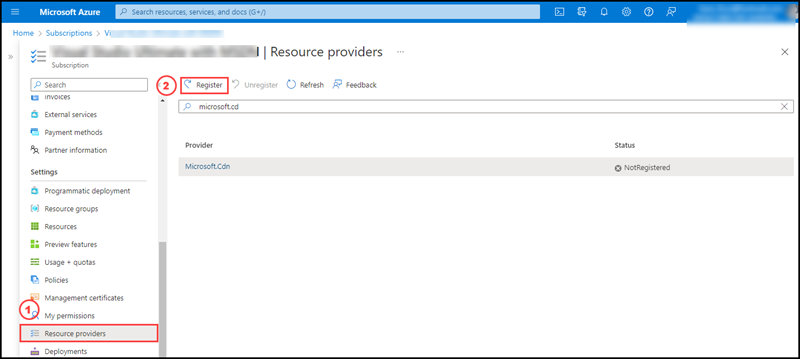
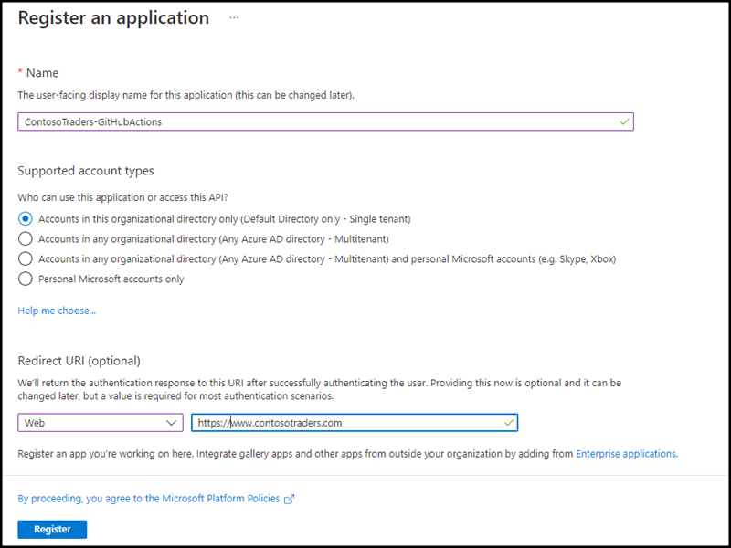
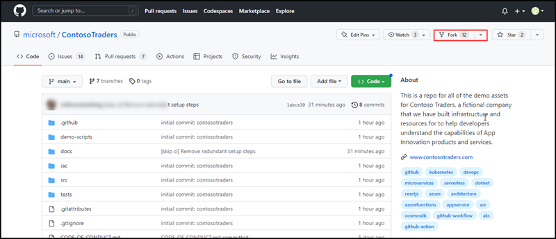
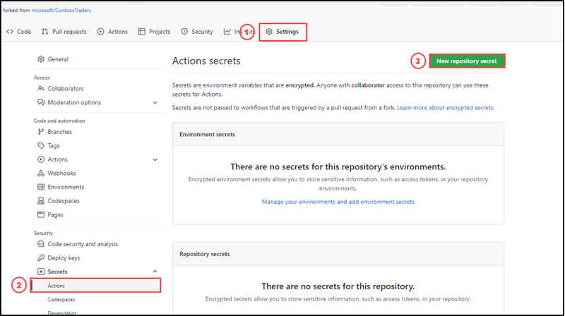
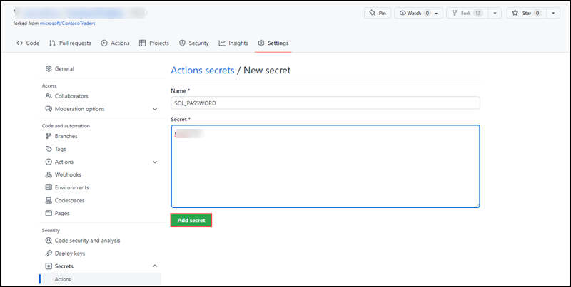
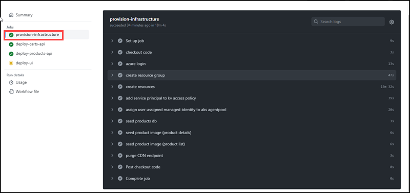
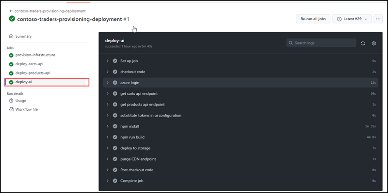
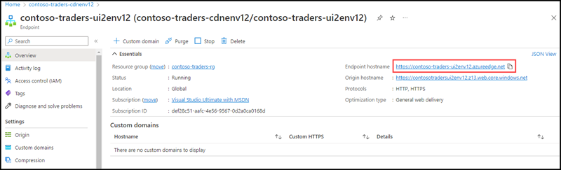
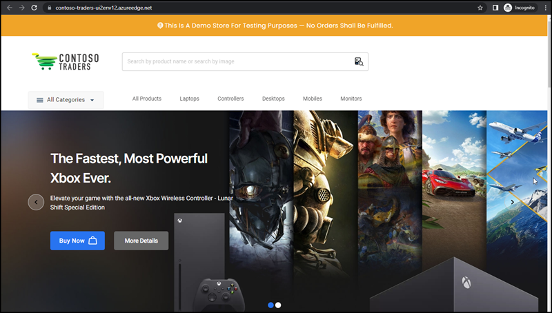

<html><h1> Contoso Traders - Deployment Guide </h1></html>

This deployment  guide is designed to help you deploy Contoso Traders application in your Azure environment. Contoso Trader is a micro-services-based application, leveraging various Azure services including Azure Kubernetes Service, App Services, Cosmos DB, SQL Database and many more. 
While it’s possible to deploy overall solution using Azure Portal, CLI, PowerShell, ARM Templates, we will be using a combination of GitHub Actions and bicep templates to automate the provisioning of overall solution. 

This will deploy all components defined in the Contoso Traders [architecture](../docs/architecture/contoso-traders-enhancements.drawio.png) 

<html><h3>Pre-Requisites</h3></html>

You will need following before we start with deployment. 
1.	An Azure Subscription with Owner rights. If you don't have an Azure subscription, create a free account before you begin by clicking [here](https://azure.microsoft.com/free/).
2.	A GitHub Account. You can create a free account [here](https://github.com/). 

<h2>Preparing your Azure Subscription</h2>

<h3>Register Required Resource Providers</h3>

You will need to register required resource providers on your Azure subscription to your subscription to use the required Azure services.   
1.	Login to Azure Portal by visiting [Azure portal](https://portal.azure.com) and sign-in with an account having Owner privileges. 
2.	Navigate to Subscription > Resource Providers
3.	Find following resource provider and click register.    
	1. Microsoft.Operationsmanagement
	2. Microsoft.Cdn
	
      
      
      
      
      
     
	This will take few minutes to complete. 

<h3>Create an Azure Service Principal</h3>

GitHub Actions will need to authenticate with your Azure account in order to deploy the application. We will be using an Azure AD Service Principal for allowing GitHub Actions to deploy the resources in Azure. 
 An Azure service principal is an identity created for use with applications, hosted services, and automated tools to access Azure resources. This access is restricted by the roles assigned to the service principal, giving you control over which resources can be accessed and at which level
Let’s create an Azure Service Principal and assign required permissions. 

1.	Sign in to your Azure Account through the Azure portal.
2.	Select Azure Active Directory.
3.	Select App registrations.
4.	Select New registration.
5.	Provide following values and click Register
	1. Name:  “ContosoTraders-GitHubActions”
	2. Supported Account Type: Select the first option - Accounts in the organizational directory only(Default Directory-Single Tenant)
	3. Redirect URI: Select Web and enter the url : https://www.contosotraders.com or your domain url you can enter.

     

Once the app is registered, please make a note of it’s Application ID,  Secret and Tenant ID.

1.	Find your newly created application in Azure AD > App Registration
2.	Make a note of Application ID & Tenant ID
     
     
     
3.	Navigate to Secrets and create a new secret.
	1. Name: ContosoTrader-Secret-GitHubActions
	2. Validity – 1 Year
4.	Make a note of the secret value. Please keep it in a safe location until next step. This value can not be retrieved once you navigate away from this page. 

Now, we will assign Owner rights to this SPN on Azure subscription. 
1.	In Azure Portal, Navigate to Subscriptions and Select your subscription
2.	Click on Access Control (IAM) and Click Add Role Assignment

     
     
3.	Select Owner as role and find the newly created SPN
	
     
4.	Click Review+Assign 

Your subscription is now ready for deployment. 

<h3>Accept Responsible AI Terms</h3>

In Contoso Traders, we are using Azure Cognitive Service to facilitate the search by image functionality. Before you can use Azure AI services, you must accept the terms for Responsible AI usage. 
In order to accept the terms, you will need to manually provision a Cognitive Service Resource using Azure Portal, with which you will be able to accept the terms. 
It is recommended to create this temporary in a separate resource group, so that you can delete the resource group once the terms are accepted. 
1. Select the following link to create a Computer Vision resource:

	[Computer vision](https://portal.azure.com/#create/Microsoft.CognitiveServicesComputerVision)
	
2. On the Create page, provide the following information:
	
<h3>Project details Description</h3>

    1. Subscription		:Select one of your available Azure subscriptions.
    2. Resource group	:Create new > Cognitive-Temp-RG
    3. Region		:The location of your cognitive service instance.
    4. Name			:A descriptive name for your cognitive services resource. For example, MyTempCognitiveServicesResource1.
    5. Pricing tier		:Free or Standard S0.
    6. Scroll down and check the box for reviewing and acknowledging Responsible AI terms. 
	
3. Click Review & Create
4. After Validating click Create

Once the provisioning is completed, you can delete the resource group “Cognitive-Temp-RG” as terms are accepted for your subscription now. 

<h2>Preparing your GitHub Account</h2>

In this step, you will form the original ContosoTraders GitHub repository to your GitHub Account and prepare for deployment. 
Fork the Contoso Traders Repo

1.	Login to GitHub by visiting [github](https://github.com).
2.	Open [ContosoTraders repository](https://github.com/microsoft/ContosoTraders) and Click on Fork
	
	

3.	You should now a clone of this repository in your GitHub Account, with https://github.com/YOURUSERNAME/ContosoTraders. 
4.	You will be using this repository for deployment. Since it exists in your GitHub Account, you will be able to make changes to the contents as well, including source code. 

<h3>Create Secrets in GitHub</h3>

GitHub Secrets are encrypted and allow you to store sensitive information, such as access tokens, in your repository. In our scenario, we will be using GitHub Secrets to store the Azure authentication credentials and other secrets. 
These secretes will be used by GitHub Action Workflows during deployment and CI/CD process.  We will be creating following three secrets

   * ENVIRONMENT: Pre-fix for resource naming, URLs etc. You can give any value, such as yournametraders
   * SERVICEPRINCIPAL: Azure Service Principal credentials for GitHub Action workflow to authenticate with Azure
   * SQL_PASSWORD: New Password for SQL DB to be created as part of deployment. 
	
Let’s get started

1. Login to GitHub and navigate to your fork of Contoso traders repository. https://github.com/YOURUSERNAME/ContosoTraders.
2. Under your repository name, click on the "Settings" tab.
	
	
	
3. In the left sidebar, click Secrets and select actions.
	
	

4. On the right bar, click on "Add a new secret"
5. Create the following secret for Azure SPN. 
	1. Secret Name: SERVICEPRINCIPAL
	2. Value: Please replace the values with your App ID created earlier.
	
	{
	
  		"clientId": "zzzzzzzz-zzzz-zzzz-zzzz-zzzzzzzzzzzz",
		
  		"clientSecret": "your-client-secret",
		
  		"tenantId": "zzzzzzzz-zzzz-zzzz-zzzz-zzzzzzzzzzzz",
		
  		"subscriptionId": "zzzzzzzz-zzzz-zzzz-zzzz-zzzzzzzzzzzz"
		
	}
	
	3. Click Add Secret
	
	

9.	Create the following secret for ENVIRONMENT.  This is a prefix for your environment and all resources are provisioned with this pre-fix to avoid conflict with public resource names in Azure. 

	1. Secret Name: ENVIRONMENT
	2. Value      : Add any combination of characters not exceeding 6 and dont take below 3
		
	 
	
	**Note: When you are creating secret for Environment please add combination of alphanumeric characters without any symbols. Maximum characters allowed is 6 and minimum characters allowed is 3. Keep small case letters**

10.	Create the following secret for SQL Password.  
	1. Secret Name: SQL_PASSWORD
	2. Value	   : Add any combination of alphanumeric characters of minimum 12
	
	
	
	
**Note : When you are creating secret for SQL password please add combination of alphanumeric characters. Minimum characters allowed is 12.Keep small case letters.**

Your GitHub repository is now ready for deployment. 

<h2>Deploying the Contoso Traders Application</h2>

You are now ready to start deployment of application to your Azure account. We will be using GitHub Action workflows for this deployment. 
We will be using following workflows as part of deployment.  You can review workflow code by navigating to .github/workflows directory in your repository. 
•	contoso-traders-provisioning-deployment: 

Let’s get started. 

1. Login to GitHub and navigate to your fork of Contoso traders repository. https://github.com/YOURUSERNAME/ContosoTraders
2. Navigate to Actions and Accept enabling the workflows
		
	
	
	
3. In the workflow list, select the “contoso-traders-provisioning-deployment” workflow.
	
4. Click on Run Workflow and run the workflow with main branch. 
	
	

5. If you refresh the page, you will see that workflow provisioning has started. You can click on workflow to see the progress live and logs.  If you navigate in the workflow execution, you will the following stages.
	1. Provision-infrastructure: This stage provisions the required resource groups and other Azure services as per architecture  and prepares them for app.
	2. You can see each stage and what it does in below screenshot 
	 
	

	3. Deploy the carts & product API: This stage provisions pushing of carts api and products api to azure container registry.
	
	
	

	5. Deploy the UI: This stage configure the endpoints of the cart api and products api.
	 
	
	
**Note : Please note that the workflow provisions all resources through bicep templates, scripts etc. We’ve observed that in many cases, Azure subscription resource cache does not get updated fast enough before the next dependent step starts executing.
If you find workflow failure error due to missing Azure resources (Key vault, CDN, container apps etc, please re-run the failed jobs.** 

<h2>Validate & test the deployment</h2>

Contoso Traders application is now ready in your subscription. Let us review and validate the deployment to ensure application is functioning as expected.

<h3>Review Provisioned Azure Resources</h3>

Please refer to the architecture walkthrough demo script and technical walkthrough to review the provisioned resources. Please check [here](../demo-scripts/cloud-native-app-architecture/technical-walkthrough.md).

<h2>Test Application</h2>

1.	Navigate to Azure and look for CDN endpoints by searching for Content Delivery Network in search menu. Type Content delivery network in the search box and select Front Door and CDN Profiles.
	
      
	
3.	Select the CDN profile starting with name contoso-traders-cdn$ENVIRONMENTNAME 

     
	
5.	Review the Endpoints and make a note of the URL for endpoint containing “UI2” website. It should look like https://contoso-traders-ui2$ENVNAME.azureedge.net
      
      
      
7.	Launch the application by clicking on the endpoint hostname url.
		
       
       
8.     The web app will launched.

      
       
9.	Test the website by navigating through various pages, search by image etc. 
	
If you would like to add a custom domain, like contosotraders.com, you can purchase the domain and add to CDN profile. Please see documentation [here](https://learn.microsoft.com/en-us/azure/cdn/cdn-map-content-to-custom-domain?tabs=azure-dns%2Cazure-portal%2Cazure-portal-cleanup).

<h2>Deploy Inventory Management PowerApps</h2>

If you are interested, you can follow these steps to deploy the inventory management application used by internal users for managing product pricing, stock etc. 
It will be hosted using Power Apps and will use Power Automate & MS Teams to enable a full inventory management and approval workflow.
Please follow the instructions here: [Deploy Inventory Management Power App](./Inventory-power-app-deployment-guide.md)
		

<h2>Try Out Demo Scripts</h2>
			

As further learning, you can try running through some of the demo scripts listed below which’d help in understanding the Azure Cloud Native Technologies.

  | Scenario                                  | Level                                                                                                                                                                                       |
  | ----------------------------------------- | ------------------------------------------------------------------------------------------------------------------------------------------------------------------------------------------- |
  | Cloud Native App Architecture Walkthrough | [Overview](../demo-scripts/cloud-native-app-architecture/overview.md) \| [Technical Walkthrough](../demo-scripts/cloud-native-app-architecture/technical-walkthrough.md)                      |
  | Autoscaling Cloud Native Apps in Azure    | [Overview](../demo-scripts/autoscaling-cloud-native-apps-azure/overview.md) \| [Technical Walkthrough](../demo-scripts/autoscaling-cloud-native-apps-azure/technical-walkthrough.md)          |
  | DevSecOps Journey with GitHub + Azure     | [Overview](../demo-scripts/devsecops/overview.md) \| [Technical Walkthrough](../demo-scripts/devsecops/technical-walkthrough.md)                                                              |
  | Low Code App Development Power Platform   | [Overview](../demo-scripts/low-code-development/overview.md) \| [Technical Walkthrough](../demo-scripts/low-code-development/technical-walkthrough.md) |
  | Intelligent Apps with Azure AI Services   | [Overview](../demo-scripts/intelligent-apps-with-azure-ai-services/overview.md) \| [Technical Walkthrough](../demo-scripts/intelligent-apps-with-azure-ai-services/technical-walkthrough.md)  |
			

<h2>Common Errors & Troubleshooting</h2>
	
This includes some of the common problems you may during deployment and approach to resolve them. 

1.	AI Terms and services:  

	 **If you see an error stating that "Responsible AI terms are not accepted for this subscription", deploy an Azure Cognitive Service resource manually in your subscription temporarily and re-run the jobs.** 
	 
3.	Lack of permissions
	
       **Check the role of the service prinipal is owner. If its not shown please provide the owner role to the service principal.**
	
5.	Environment name having not allowed characters
	
	**When you are creating secret for Environment please add combination of alphanumeric characters without any symbols. Maximum characters allowed is 6 and minimum characters allowed is 3. Keep small case letters**
	
8.	Subscription quota: 
	
	**If you get an error related to subscription quota, you may need to raise quota requests in your subscription. For the details of subscription quota please click [here](https://learn.microsoft.com/en-us/azure/azure-resource-manager/management/azure-subscription-service-limits).**

10.	Can not find resources (Key Vault, CDN, Storage Account, etc. )

	**Please note that the workflow provisions all resources through bicep templates, scripts etc. We’ve observed that in many cases, Azure subscription resource cache does not get updated fast enough before the next dependent step starts executing.
	If you find workflow failure error due to missing Azure resources (Key vault, CDN, container apps etc, please re-run the failed jobs.**
	
<h3>Known Issues</h3>
	
When you run the workflow, it shows following warnings.
	
**Error: WARNING: /home/runner/work/ContosoTraders/ContosoTraders/iac/createResources.bicep(191,50) : Warning no-hardcoded-env-urls: Environment URLs should not be hardcoded. Use the environment() function to ensure compatibility across clouds. Found this disallowed host: "database.windows.net". **

**Warning: WARNING: /home/runner/work/ContosoTraders/ContosoTraders/iac/createResources.bicep(191,50) : Warning no-hardcoded-env-urls: Environment URLs should not be hardcoded. Use the environment() function to ensure compatibility across clouds. Found this disallowed host: "database.windows.net". **

This does not block the deployment and workflow will run successfully. It does not have any other impact. It is being tracked here https://github.com/microsoft/ContosoTraders/issues/68 

<h2>Questions & Support</h2>
	
This project is community supported. Please raise issue via GitHub incase of issues/questions. 

<h2>Cleanup</h2>

Once you are done deploying, testing, exploring, you can delete the provisioned RGs to prevent incurring additional cost. 
Delete the following resource groups.
1.	contoso-traders-rg
2.	contoso-traders-aks-nodes-rg
