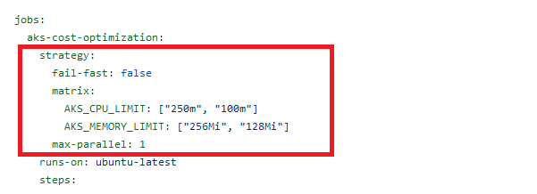
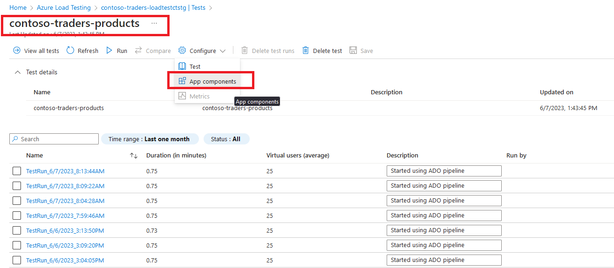
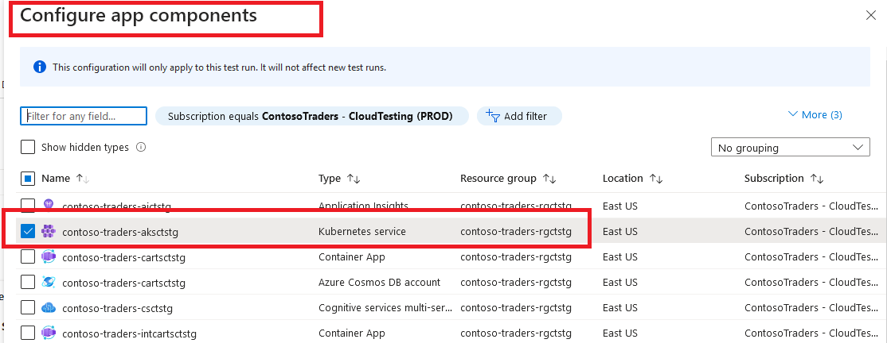
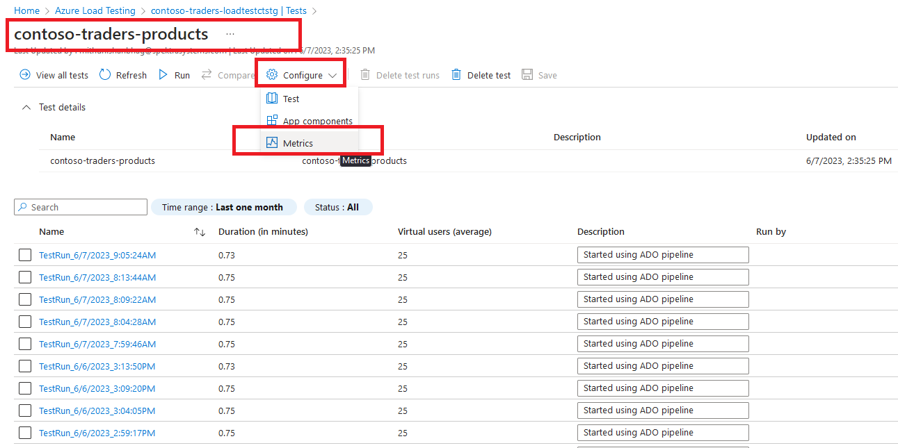
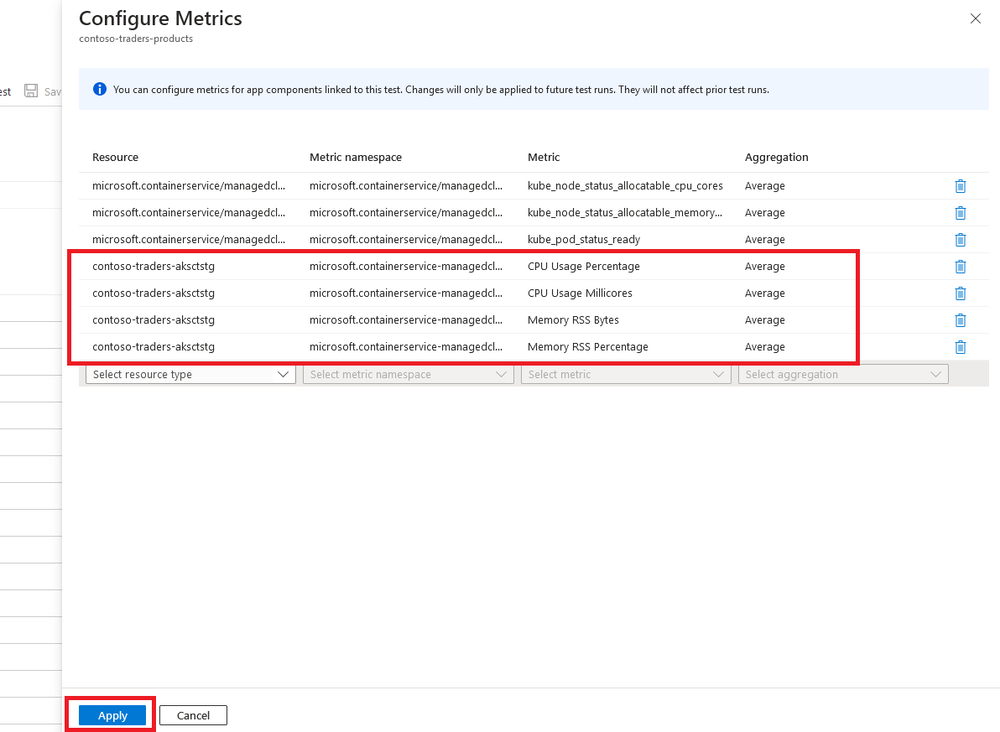
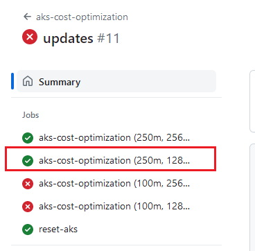

# Azure Load Testing: AKS Cost Optimization

## Key Takeaways

In this demo, we'll see how Azure Load Testing can be used to help "right-size" an AKS cluster. The demo will start with a representative load test against a large AKS cluster. We'll iteratively scale down the cluster until we find the smallest cluster size that can handle the load. We'll also use the load test's integrated server-side metrics to analyze the cluster's resource utilization.

## Before you begin

Please execute the steps outlined in the [deployment instructions](../../docs/deployment-instructions.md) to provision the infrastructure in your own Azure subscription.

## Walkthrough

1. We have a GitHub workflow (and a Azure DevOps pipeline too) that executes load tests on a AKS cluster using a matrix of cluster sizes. The workflow is defined in the [aks-cost-optimization.yml](../../.github/workflows/aks-cost-optimization.yml) file. The workflow can be triggered manually on-demand.

   

2. The load test, defined in the [load-test-aks.yml](../../.github/workflows/load-test-aks.yml) file, targets the `Products API`.

3. [Optional Step] From the Azure Portal, we'll tweak the existing load test `contoso-traders-products` to incorporate server side AKS metrics using steps below:

   

   

   

   

4. We manually invoke the GitHub workflow. In the beginning, the AKS cluster's size is automatically increased (CPU Limit: 250m, Mem Limit: 256 Mi) and a load test is run against it with 25 virtual concurrent users (threads) for a short duration of 30 seconds.

5. In the next matrix step, the cluster is automatically rescaled a smaller size (CPU Limit: 250m, Mem Limit: 128 Mi) and the load test is run again.

6. In next iterations, the scale down continues until the cluster is unable handle the load any longer. The last passing iteration is the smallest cluster size that can handle the load. In below example, the "right-sized" cluster will have CPU Limit: 250m, Mem Limit: 128 Mi.

   

## Cost Considerations

A quick note on costs considerations when you run the GitHub workflow (or Azure DevOps pipeline):

1. Github Actions ([pricing details](https://docs.github.com/en/billing/managing-billing-for-github-actions/about-billing-for-github-actions#included-storage-and-minutes)): Each run will consume approximately 25 billable minutes on linux runners.

2. Azure Load Testing ([pricing details](https://azure.microsoft.com/pricing/details/load-testing/)): The number of virtual users and duration of the test are the key factors that determine the cost of the test. In this demo, the load tests are configured to use 25 virtual users and the test matrix sets up 4 test runs, each of 30 seconds duration.

## Summary

In this demo, we saw how Azure Load Testing was used to help "right-size" an AKS cluster to optimize costs. The demo started with a representative load test against a large AKS cluster. We iteratively scaled down the cluster until we found the smallest cluster size that can handle the load.
