# Azure Load Testing: Private Endpoints

## Key Takeaways

In this demo, we'll attempt to load test an private API endpoint using the Azure Load Testing Preview. The private API endpoint in question is only accessible from within an Azure virtual network (VNET).
We'll demonstrate Azure Load Testing service's capability to generate load from within a virtual network (using VNET resource injection).

## Before You Begin

Please execute the steps outlined in the [deployment instructions](../../docs/deployment-instructions.md) to provision the infrastructure in your own Azure subscription.

> **Warning**
To deploy the additional resources for this walkthrough ensure you have set the GitHub Action's variable `DEPLOYPRIVATEENDPOINTS` to `true`. If you're using Azure DevOps Pipeline, then please ensure that the variable `DEPLOYPRIVATEENDPOINTS` is set to `true` in the `contosotraders-cloudtesting-variable-group` variable group.
 

Specifically, here's what happens behind the scenes:

* An Azure virtual network (VNET) is created with three subnets:
  * A subnet for Azure Container Apps to deploy its infrastructure as well as the application's API private endpoints.
  * A subnet for Azure Load Testing to inject its resources.
  * A subnet for Azure VMs (jumpboxes) to access the application's private endpoints (for visual verification purposes).

* An Azure Container Apps instance is deployed to host the application's API endpoints. The API endpoints are configured to be private endpoints, and the ingress controller only allows internal VNET traffic (i.e. endpoint is only accessible from within the VNET).

* A private DNS zone (e.g. `eastus.azurecontainerapps.io`) is created to resolve the private endpoints' DNS names. This private DNS zone is associated with the VNET's subnet ACA. We add the necessary A records to link the endpoint FQDN to the ACA's private IP address.

* A jumpbox VM is deployed to the VNET's VM subnet. This VM will be used in this demo to access the application's private endpoints.

  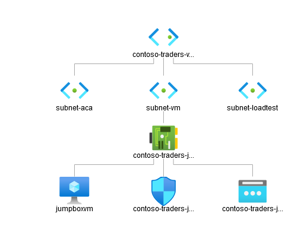

## Walkthrough: Identify the Load Test Target

1. In the Azure portal, you can navigate to the `contoso-traders-intcarts{SUFFIX}` Azure Container App in the `contoso-traders-rg` resource group. This is the application that hosts the `Carts API`. Note that this application is only accessible from within the VNET.

   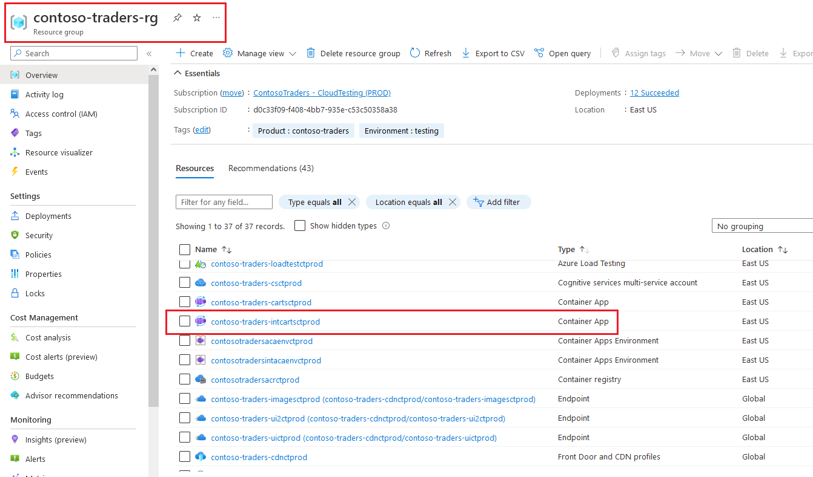

2. You can get the URL of the `Carts API` by as shown below.

   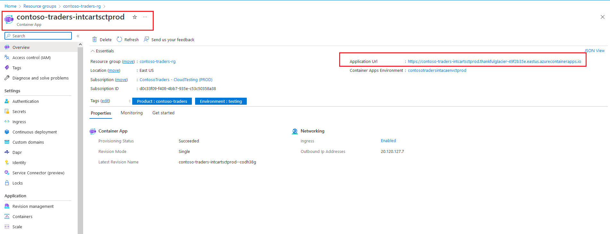

3. In a separate browser tab, enter the following url in the address bar to load the API's swagger page: `<ACA url>/swagger/index.html`. You'll notice that the API's endpoints are not reachable via the public internet.

   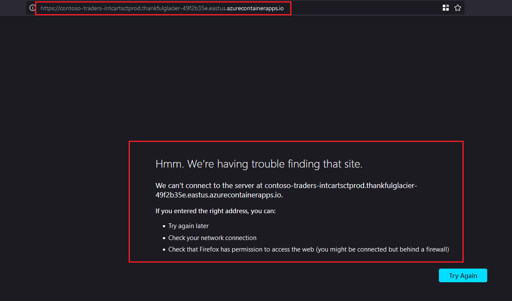

4. To access the API's endpoints, you'll need to access the API from within the VNET. You can RDP into the `jumpboxvm` VM. This is a jumpbox VM located in the same resource group `contoso-traders-rg`. From this RDP session, you can access the API's swagger page: `<ACA url>/swagger/index.html`

   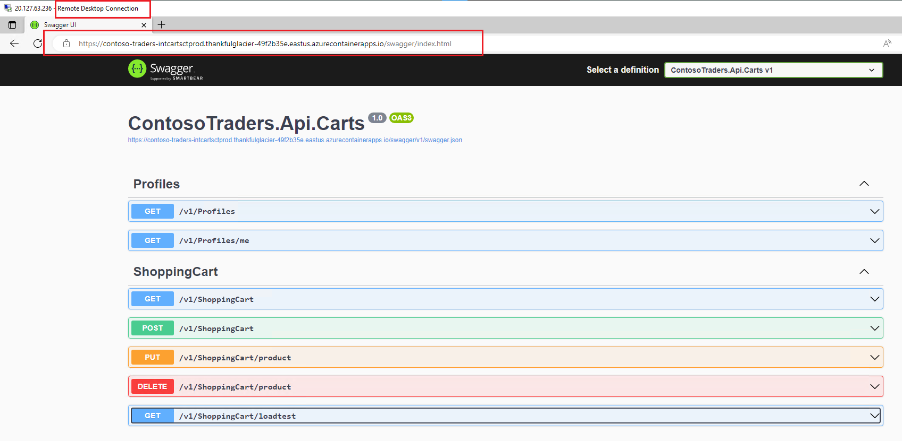

5. The specific API that we'll be using for is the `Carts API`'s `GET <ACA url>/v1/ShoppingCart/loadtest` endpoint. Please note down this endpoint for later use.

   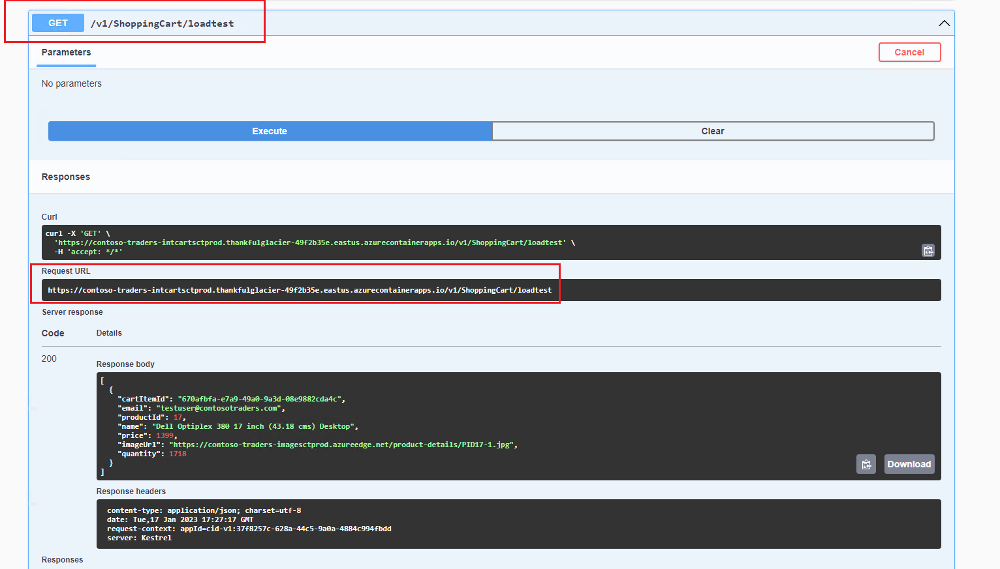

## Walkthrough: Modify the previously created Load Test

1. In the Azure portal, navigate to the Azure Load Testing instance (in the `contoso-traders-rg` resource group) that we created in the [previous demo](./walkthrough.md).

2. Now click on `Configure` > `Tests`.

   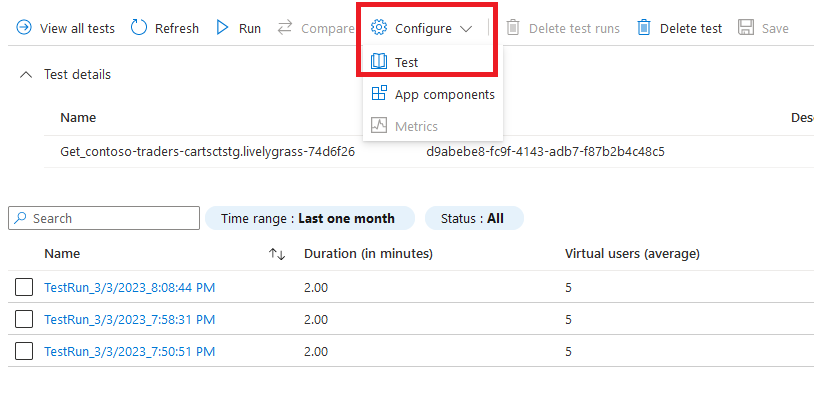

3. Navigate to the `Parameters` tab in the Edit Test blade. Modify the `domain` value to point to the `Carts API`'s private endpoint. You can use the `<ACA url>` you noted down earlier (note: please remove the `https://` prefix).

   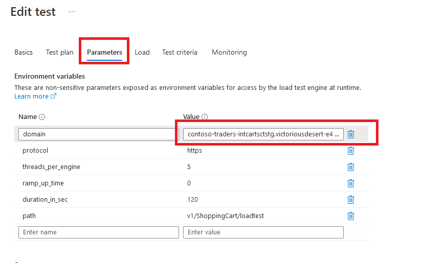

4. Navigate to the `Load` tab. Change `Configure test traffic mode` to `private`. Also, specify the VNET and subnet details: `contoso-traders-vnet{SUFFIX}` and `subnet-loadtest` respectively.

   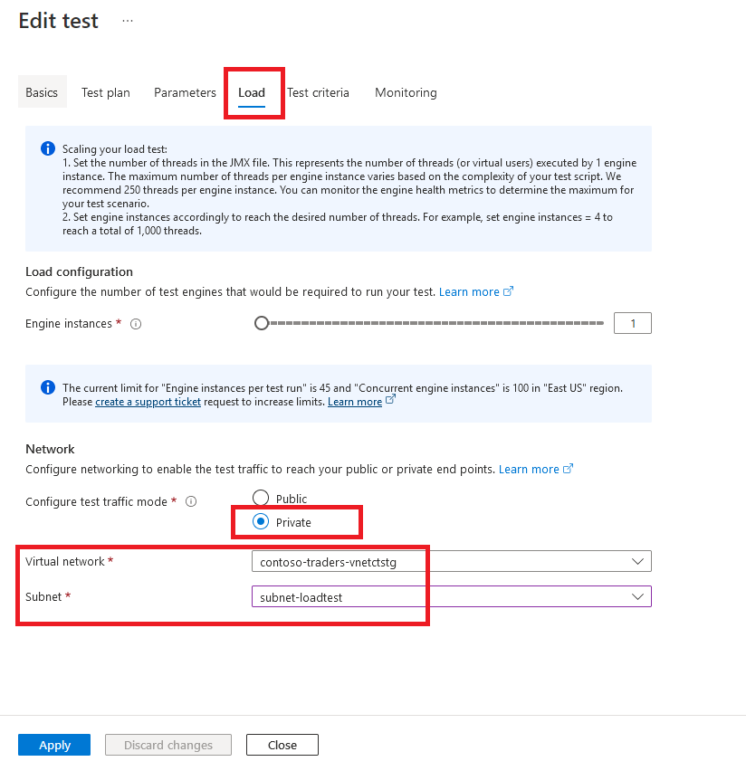

5. Click apply to save the changes.

6. Now, click `Run` to start the load test against the private endpoint.

   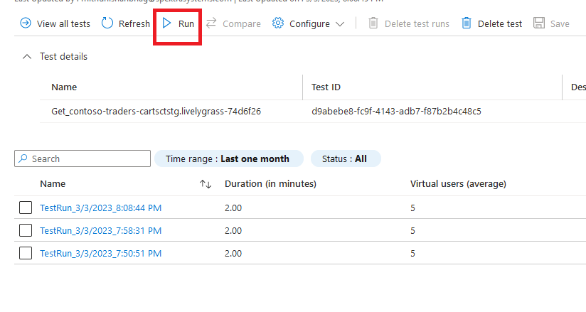

7. Behind the scenes, the Azure load testing service will inject the testing infrastructure into the specified VNET. The load test will successfully run to completion after that.

   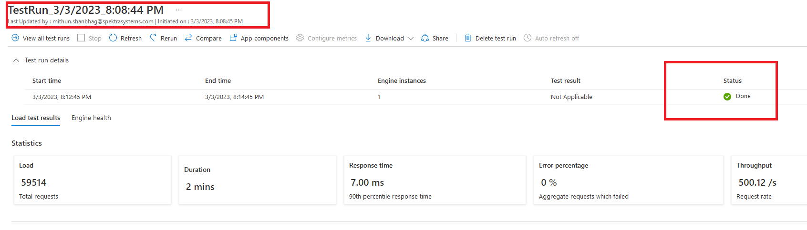

## Summary

In this demo, we saw how Azure Load Testing can be used to generate load from within a virtual network to test private/restricted API endpoints.

## More Information

* [Troubleshooting private endpoints](https://docs.microsoft.com/azure/container-apps/troubleshoot-private-endpoints)
* [Test private endpoints by deploying Azure Load Testing in an Azure virtual network](https://learn.microsoft.com/azure/load-testing/how-to-test-private-endpoint)
* [Scenarios for deploying Azure Load Testing in a virtual network](https://learn.microsoft.com/azure/load-testing/concept-azure-load-testing-vnet-injection)
* [Blog Post: Load test endpoints with access restrictions using Azure Load Testing](https://techcommunity.microsoft.com/t5/apps-on-azure-blog/load-test-endpoints-with-access-restrictions-using-azure-load/ba-p/3610412)
* [Blog Post: Load test private endpoints deployed in another Azure region or subscription](https://techcommunity.microsoft.com/t5/apps-on-azure-blog/load-test-private-endpoints-deployed-in-another-azure-region-or/ba-p/3693277)
