# Azure Load Testing: Overview

## Key Takeaways

In this demo, you'll get an overview of Azure's Load Testing service; a managed service that can be used to simulate load on your application's UI and APIs endpoints.

You'll also get an insight into:

- how to identify an application's breaking point under incrementally increasing load.
- how to leverage server-side metrics and Azure AppInsights to identify the performance bottleneck.
- how to guard your application against performance regressions leveraging load testing in CI/CD pipelines.

All these are especially crucial for an e-commerce application like Contoso Traders, which is expected to instantly handle a large, sudden spike in number of users, with low latency and no downtime.

## Before You Begin

Please execute the steps outlined in the [deployment instructions](../../docs/deployment-instructions.md) to provision the infrastructure in your own Azure subscription.

## Walkthrough: Identify the Load Test Target

1. In the Azure portal, you can navigate to the Azure Container App in the `contoso-traders-rg{SUFFIX}` resource group. This is the application that hosts the `Carts API`.

   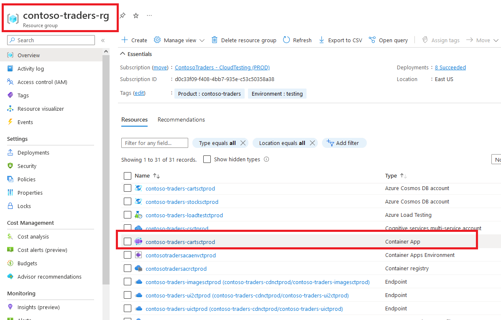

2. You can get the URL of the `Carts API` by as shown below.

   

3. In a separate browser tab, enter the following url in the address bar to load the API's swagger page: `<ACA url>/swagger/index.html`

   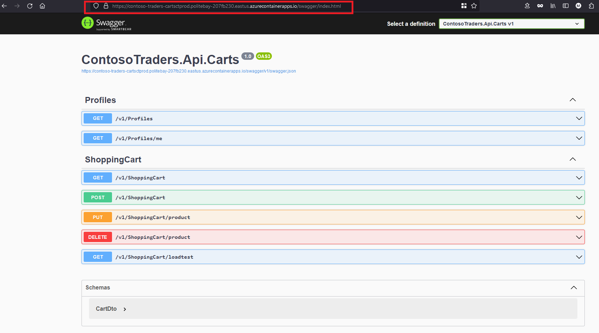

4. You can now identify the API that you want to load test. In this case, we'll be load testing the `Carts API`'s `GET <ACA url>/v1/ShoppingCart/loadtest` endpoint. Please note down this endpoint for later use.

   

## Walkthrough: Creating a Load Test

1. In the Azure portal, you can navigate to the Azure Load Testing service in the `contoso-traders-rg{SUFFIX}` resource group.

   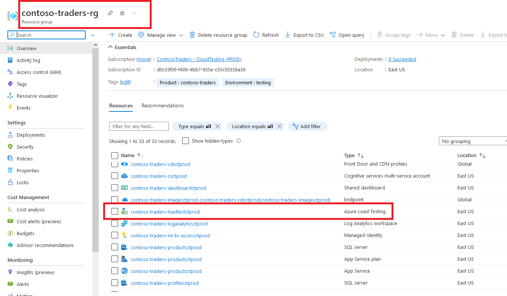

2. You can create a new load test as follows: Navigate to the `Tests` section, and then click on `Create` > `Create a URL-based Test` button.

   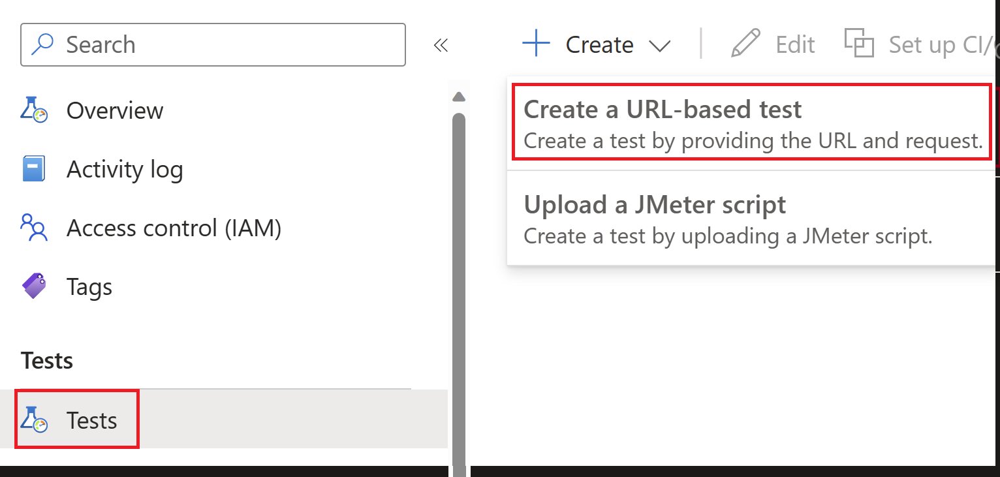

3. In the `Basic` blade, you can specify the target URL. You can also specify the number of concurrent users, and the duration of the test. See example below:

   

> **Note**: The target URL is the URL from the `Carts API` that you identified in the previous section.

## Walkthrough: Running the Load Test

1. Once you've entered the load test specifications above, you can run it by clicking on the `Run` button.

   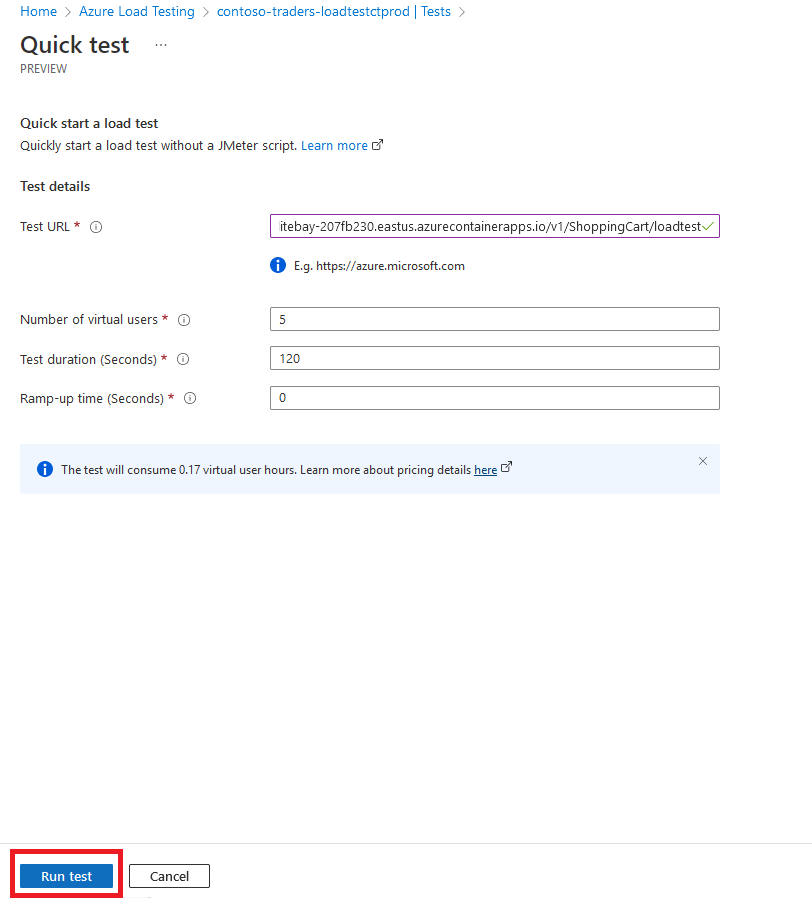

2. The load test will take about 2 minutes to complete. Once done, it'll display the summary and client-side metrics.

   

   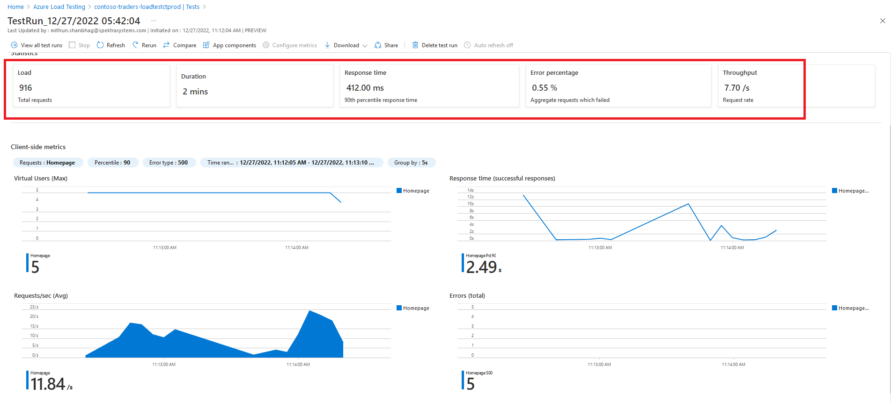

## Walkthrough: Incorporate Server Side Metrics

1. Click on the `App Components` button. Then from the flyout, select the `contoso-traders-carts{SUFFIX}` CosmosDB component. This will add relevant metrics from the CosmosDB to the load test dashboard.

   

2. Re-run the load test, and you'll see the impact of the synthetic load on the DB (in real-time).

   

> **Note**: Unfortunately, ACA metrics are not yet supported in Azure Load Testing's server side metrics. This feature will be coming soon.

## Walkthrough: Review ACA Metrics & Dashboards

1. In the Azure portal, you can navigate to the Azure Container App in the `contoso-traders-rg{SUFFIX}` resource group.

   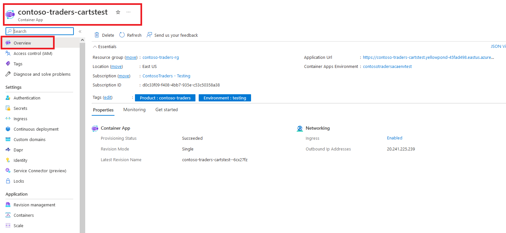

2. For demo purposes, we have configured a `HTTP Scaling` rule that horizontally scales out additional replicas when the number of concurrent requests exceeds a threshold (`3` in this case). ACA also supports automatic scale-in to zero when traffic dips below threshold.

   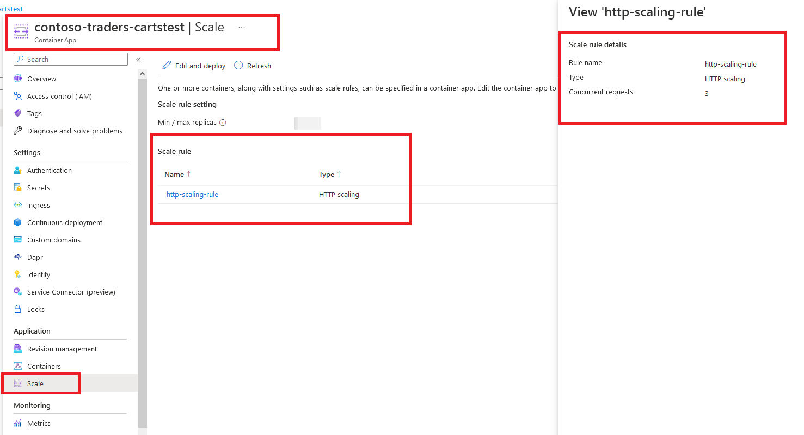

3. In the metrics tab, you can see the various metrics measured & published by the ACA infrastructure. You can create a metric chart that combines two metrics: `replica count` vs `requests`. It'll now have updated with the latest data after the load test. Of particular interest is the replica count chart of `Carts API`, which shows the instances auto-scaled out under increasing load. After load subsided, the instances auto-scaled back in to zero.

   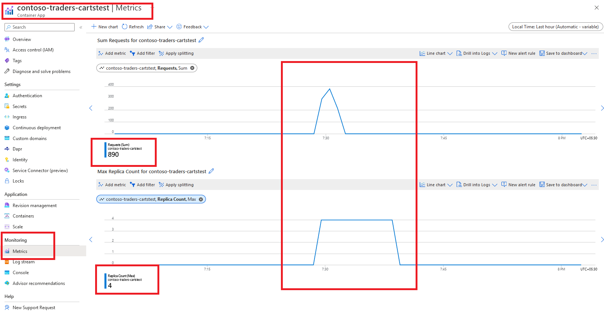

## Walkthrough: Export the JMX File, Results

1. Navigate back to the Load Testing service, and click on the recently concluded test run. From there you can click on `Download` > `Input File`. This will download the JMX file in a zip archive.

   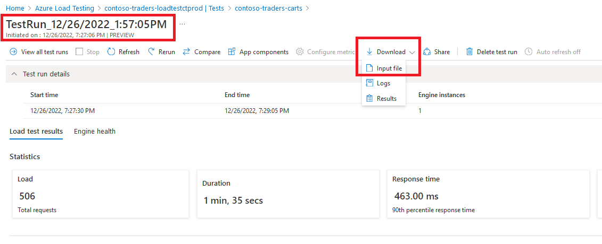

2. You can review the JMX file by simply loading it up in notepad or VSCode.

   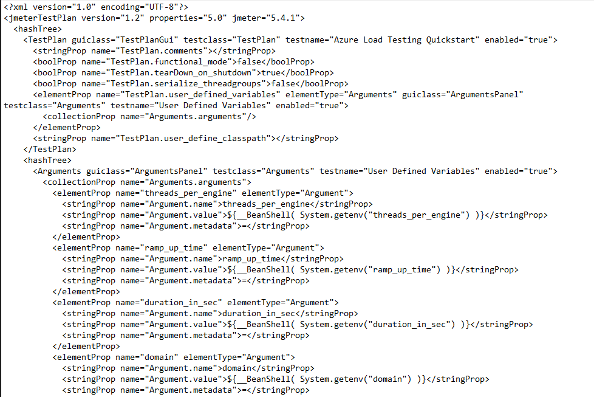

3. The load test results can also be downloaded via in the `Download` > `Results` button. This will download a CSV file (inside a zip archive).

   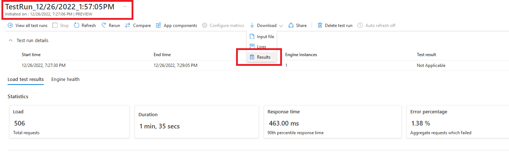

   

## Walkthrough: Identify application's breakpoints

1. Let us now modify the existing load test. We'll use it to put the application under increasing load, ultimately leading to failure. The goal is to identify the application's breakpoints (performance bottlenecks).

   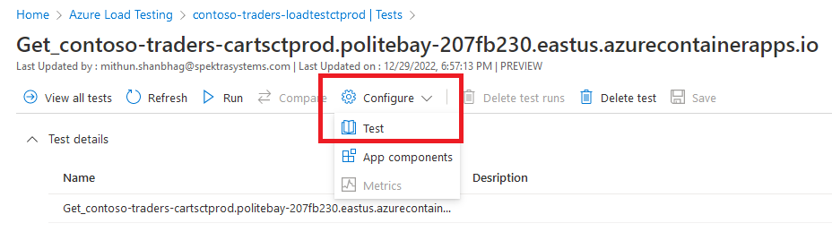

2. Modify the existing test configuration as follows:

   1. Increase the number of concurrent users to `250` (from original `5`).
   2. Change the test duration to `300` seconds (from original `120` seconds)
   3. Change the ramp-up time to `300` seconds (from original `120` seconds).

   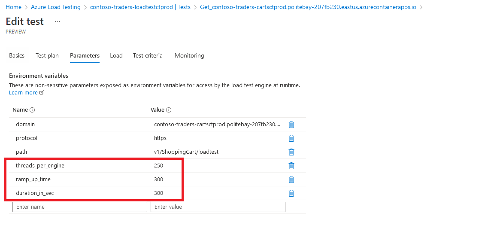

3. Increase the number of engine instances to `2` (from original `1`).

   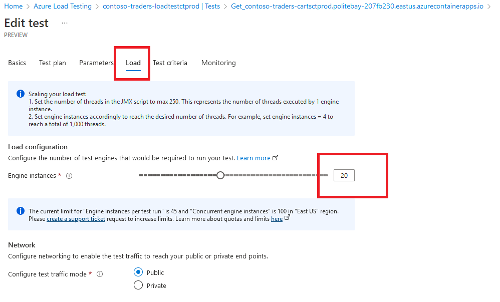

4. Run the modified load test. You'll notice that the application starts to eventually fail under the increased load.

   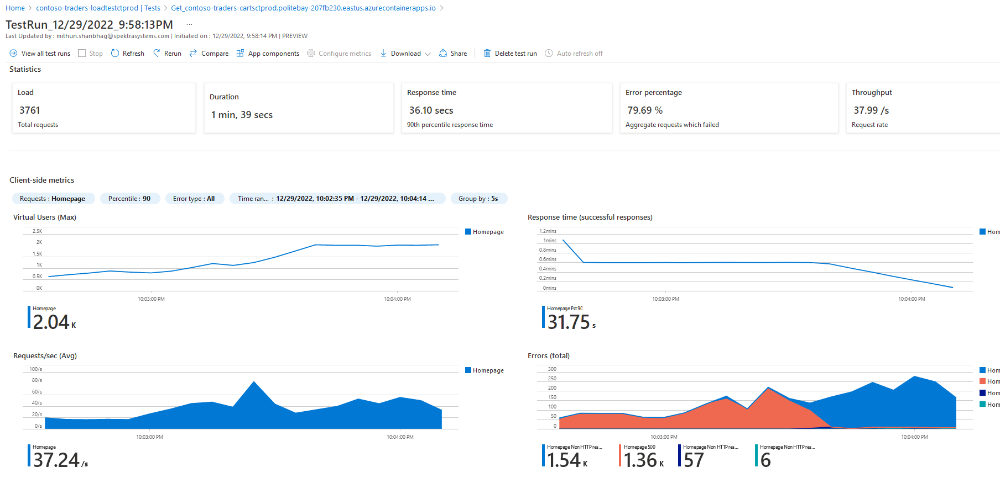

5. If you add the server-side metrics for the `contoso-traders-cartsct{SUFFIX}` CosmosDB, you'll notice that the DB's normalized RU consumption eventually starts to peg at 100% under load.

   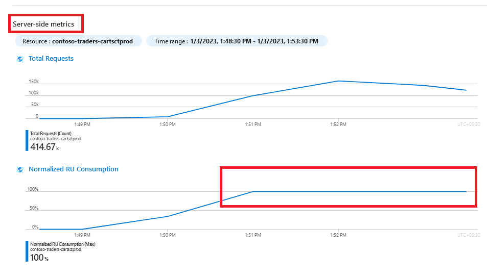

6. App Insights can help us narrow down the root cause of the error. Navigate to the `contoso-traders-rg{SUFFIX}` resource group, and click on the `contoso-traders-aict{SUFFIX}` resource.

   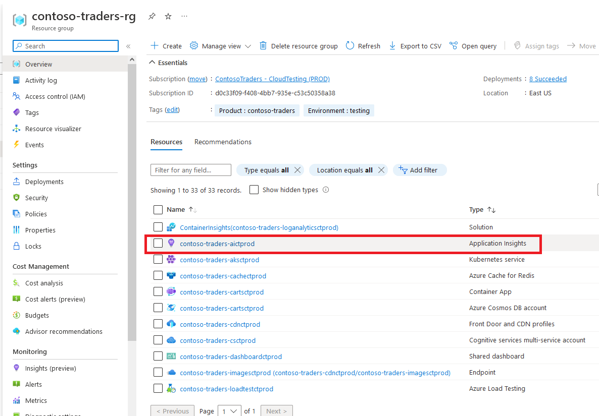

7. In the App Insights blade, click on the `Failures` tab. Narrow down the time range to (say) the last 30 minutes. You'll see the listed failures (sampled by App Insights) that occurred during the load test.

   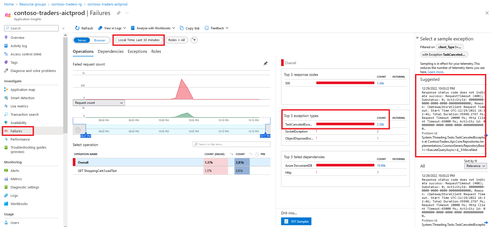

8. Clicking on any one sample will give you a detailed view of the error (including stack trace in case of an exception). In this case, the error is a `500` error, caused by a `TaskCanceledException` (due to a gateway timeout in CosmosDB). This is a good indication that the application is failing due to a performance bottleneck.

   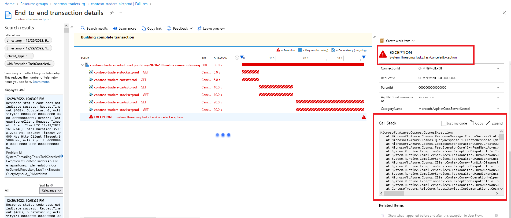

## Walkthrough: Regression Testing with Github Workflows

1. We have a GitHub workflow that executes load tests on the application's APIs. This workflow is automatically triggered on every checkin to the `main` branch. Specifically the load tests are run on the `Product API` and `Carts API` immediately after they're deployed to the AKS cluster and ACA respectively. This will help identify if any code (or infra) change causes the application performance to degrade under (simulated) load.

   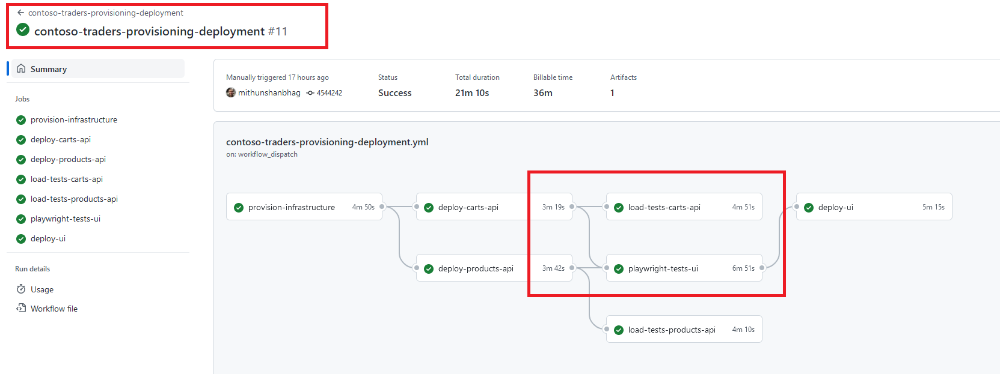

2. The workflow uses a github action to invoke the [Azure Load Testing](https://learn.microsoft.com/en-us/azure/load-testing/) service and simulate load on the application's `Product API` and `Carts API`, which are hosted on AKS and ACA respectively.

   

3. The workflow file references a load test configuration file (yml), which specifies the following:
   1. The load test parameters.
   2. The JMX/JMeter script to be used.
   3. The pass/fail criteria for the test.

   See an example of a load test configuration file below.

   ```yaml
   testName: contoso-traders-carts
   testPlan: contoso-traders-carts.jmx
   engineInstances: 1
   failureCriteria:
      - avg(response_time_ms) > 5000
      - percentage(error) > 20
   ```

4. The load test takes about 3 minutes to execute. In this specific example, you can see that the load test failed since the average response time exceeded the specified threshold of 5000ms.

   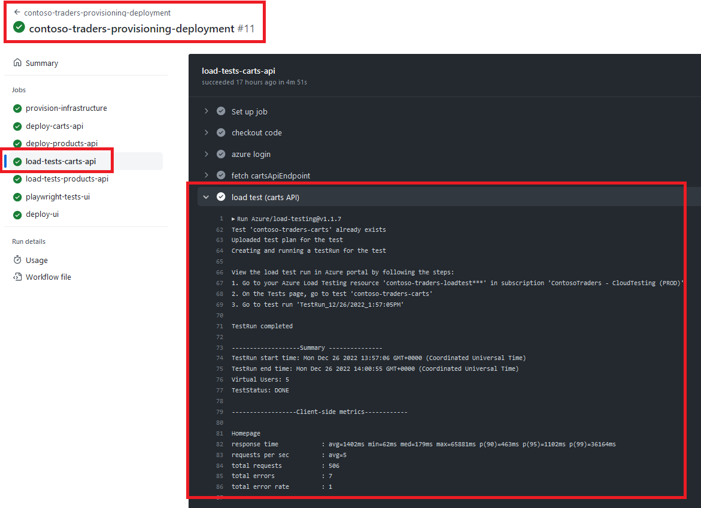

5. Once done, you can navigate to the Azure Portal to get more in-depth details about the test.

   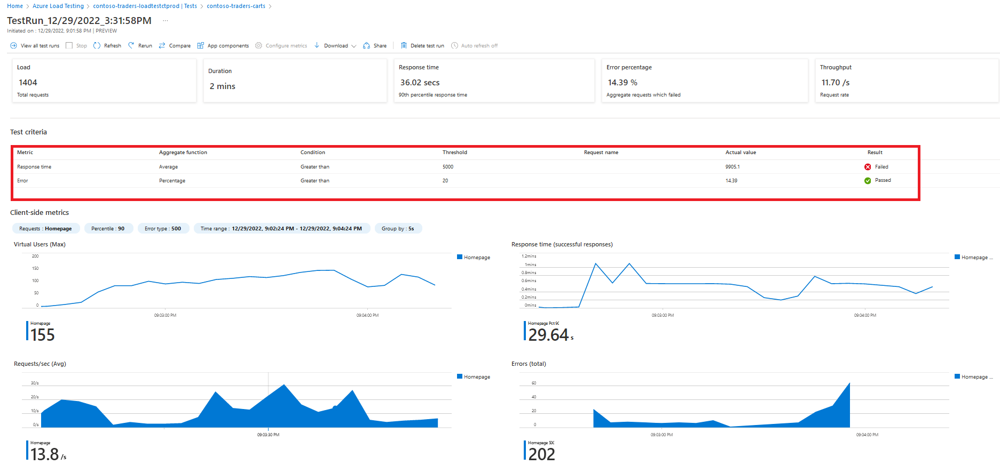

## Summary

In this demo, you got an overview of Azure's Load Testing service; including how to create a load test, run it, and review the results. You also saw how to incorporate server-side metrics from Azure Services, and how to export the JMX file and results. Finally, you saw how to create a new load test from the JMX file, and how to use a GitHub workflow to execute load tests on the application's APIs.

## More Information

- [Azure Load Testing](https://learn.microsoft.com/azure/load-testing/)
- [Blogs on Azure Load Testing](https://techcommunity.microsoft.com/t5/apps-on-azure-blog/bg-p/AppsonAzureBlog/label-name/Azure%20Load%20Testing)
- [Pricing](https://azure.microsoft.com/pricing/details/load-testing/)
