# DevOps with GitHub & Azure: Technical Walkthrough  

## Key Takeaways

The key takeaways from this demo are:

- GitHub Actions is used to automate the deployment of the application and infrastructure. Using GitHub Action workflows, the application and infrastructure can be deployed to Azure cloud with a single click, allowing you to implement continuous integration and continuous deployment process.  
- GitHub Actions integrates with Azure services to enable you to build, test, and deploy to Azure directly from your GitHub repository, along with tons of other integrations.
- Using GitHub Actions, you will be able to incorporate your application testing, performance testing to validate your application for production readiness as part of your DevOps process itself.  
- As part of this demo script, you will be adding a new feature to enable **dark mode** capability on Contoso Traders Website, along with adding playwright based testing in your DevOps cycle.
  
## Before you Begin

You must have Contoso Traders deployed in your environment and setup with GitHub Actions.  Please refer to the deployment instructions [here](../../docs/deployment-instructions.md)

## Walkthrough – GitHub Actions for CI/CD

GitHub Actions is a way to automate processes and workflows in your GitHub repository. Some of the benefits of using GitHub Actions include the ability to automate your software development lifecycle, integrate with other tools and services, including Azure services.

Let us take a look at the GitHub Actions used by Contoso Traders for CI/CD.

## Review Workflows used in Contoso Traders

1. Navigate to [ContosoTraders CloudTesting repository.](https://github.com/microsoft/ContosoTraders-CloudTesting)

2. Go to the **github/workflows** folder; inside, you'll find the workflow **YAML file** that are used to deploy and set up the resources.  

    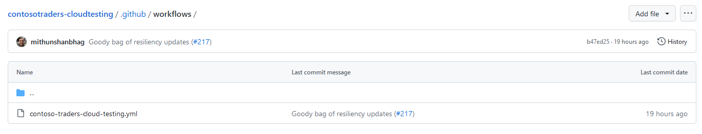

3. Here is a quick overview of the workflow. If you are interested, you can review the workflow code to get into more details.  

    a. **contoso-traders-cloud-testing:**  This workflow provisions Azure resources used for hosting the application, deploys the application to the provisioned resources. It also runs load testing & playwright tests as part of CI/CD cycle ensure the app is production ready with each change.

     It includes everything needed to get the application up and running in an Azure Environment.

      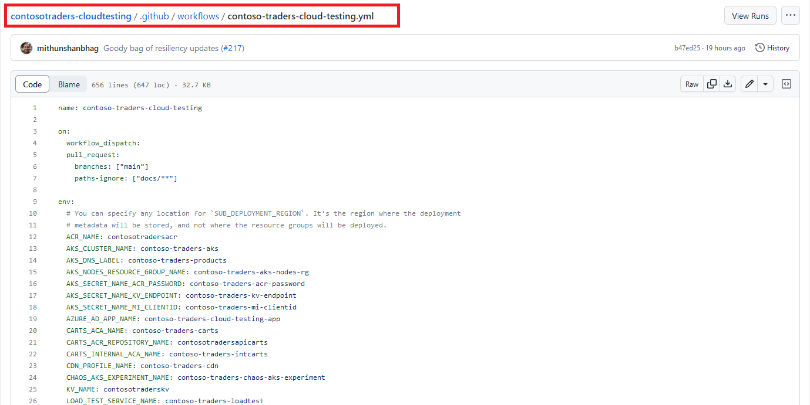

## Monitor GitHub Actions Workflow

GitHub Actions workflows can be monitored from the Actions tab on a repository. This tab shows a list of all the active and past workflows, along with their status and any associated logs. Users can see at a glance whether their workflows are running successfully and can troubleshoot any issues that may arise. Additionally, users can set up notifications to be alerted when a workflow starts or completes, or if it encounters an error. This can help users stay on top of their workflows and ensure that their projects are running smoothly.

Let us take a look at the workflows status for Contoso Traders in this public repository.

1. Navigate to [ContosoTraders/Actions](https://github.com/microsoft/ContosoTraders-CloudTesting/actions). Select the workflow **contoso-traders-cloud-testing**. This will the history of workflows execution.  

    

2. Select the latest run from the list. In Summary, you will see 5 jobs listed.

    - `provision`: Used for provisioning Azure resources, configure access policies and permissions, seeding initial database.
    - `playwright-tests-ui`: Used to execute playwright tests to validate UI functionalities before the UI service is deployed.
    - `load-tests-carts-api`: Used to execute Azure Load testing to validate performance for Carts API.
    - `load-tests-carts-internal-api`: Same as above, but executes Load testing against an internal/private API endpoint.
    - `load-tests-with-chaos-products-api`: Used to execute Azure Load testing to validate performance for Products API with simultaneous chaos experiments (fault injection) enabled.

    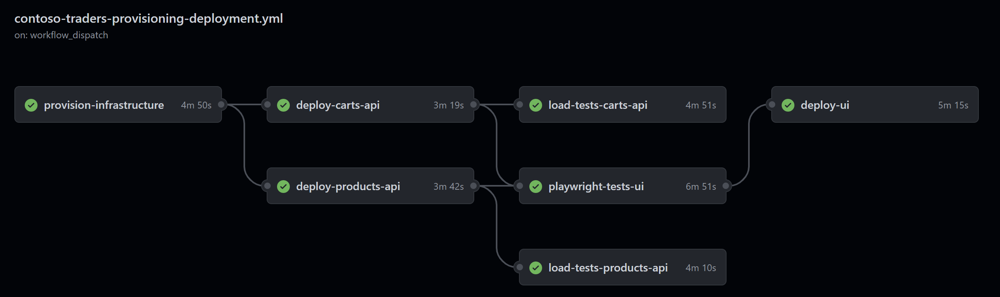

3. Click on **provision** job. You can now see the detailed task of this job and expand to see the logs and steps.

   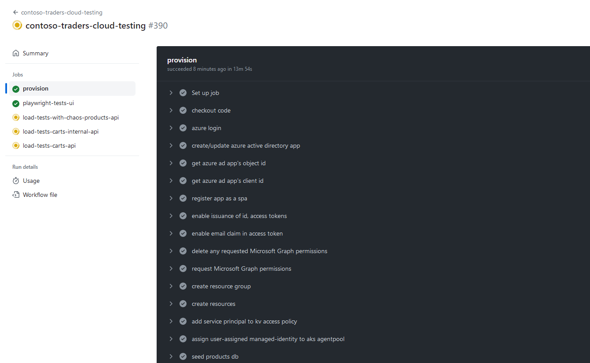

  Similarly, you can review other jobs and workflows. Workflow are set to run on push to the main branch so that any new code change to the main branch is automatically built and deployed.
  
## Demo – Experience GitHub Actions in Action  

Now that we have reviewed the GitHub Actions workflows, let us take a step-by-step approach to test the end-to-end CI/CD process.  As part of enhancement to the Contoso Traders website, you are asked to add **dark mode** functionality to the website.

Let us add the dark mode functionality to the application by modifying the source code of our website.

  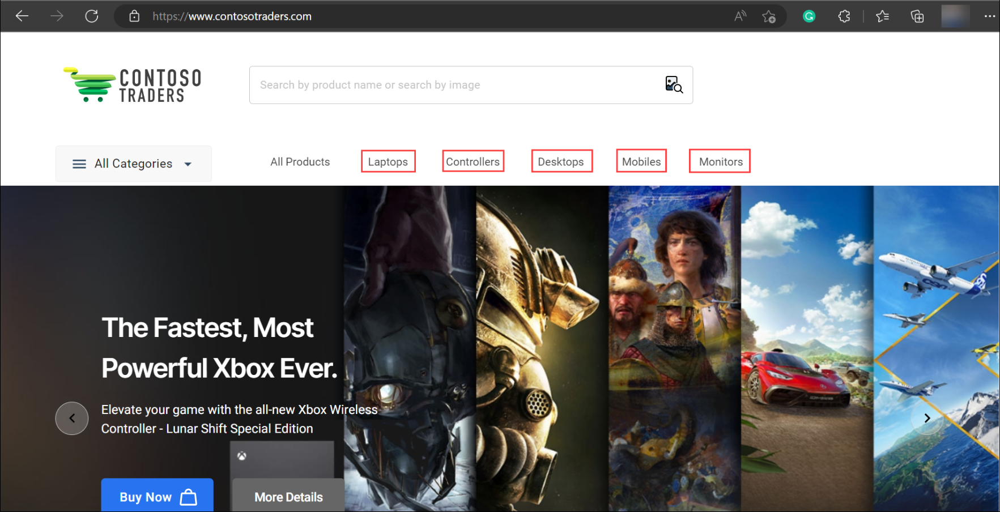

Your marketing team requires changing this to following

Contoso Traders is one stop shop for electronics items including smartphones, laptops, and other popular gadgets. Contoso Traders delivery premium quality electronics at affordable rates to resellers across the globe.  

Let us make the changes and experience magic of GitHub Actions.  

1. Login to your fork of Contoso Traders repository and navigate to Contoso Traders repository `https://github.com/**YOURGITHUBUSERNAME**/ContosoTraders-CloudTesting`.

2. Create a new branch **add-dark-mode**.

    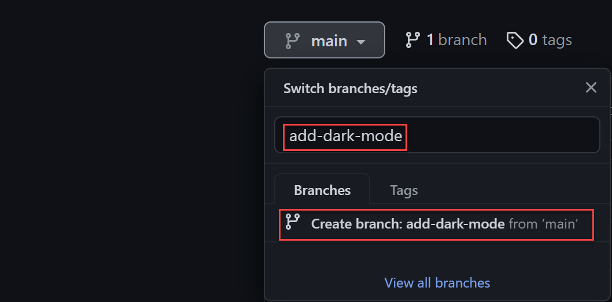

3. Navigate to appbar.js file, located in  **src/ContosoTraders.Ui.Website/src/shared/header/appbar.js**

4. To make it easier for you to complete this change, source code already include code blocks for adding dark mode functionality. You will need to uncomment the code block, let's start by clicking on edit **symbol (2)**.

5. Uncomment line number 8, 414,415 & 416.

    

    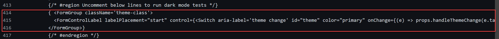

6. Commit the change to add-dark-mode branch. Click on Commit changes after updating commit message.  

     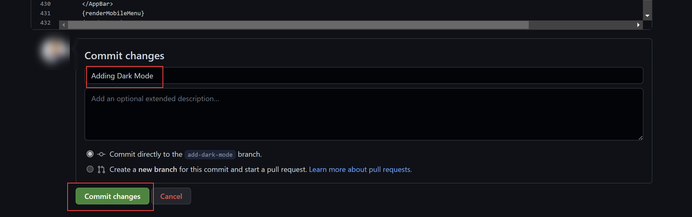

7. Now, let's update playwright tests to include testing for dark mode functionality. Edit **darkmode.spec.ts** located in **src/ContosoTraders.Ui.Website/tests** and remove the `skip` annotation from line 7. 

8. Now, let us raise a pull request to merge this change to **main branch**. Click on **Pull Requests** and notice that changes are detected already. Click on **Review and raise Pull Request**.

    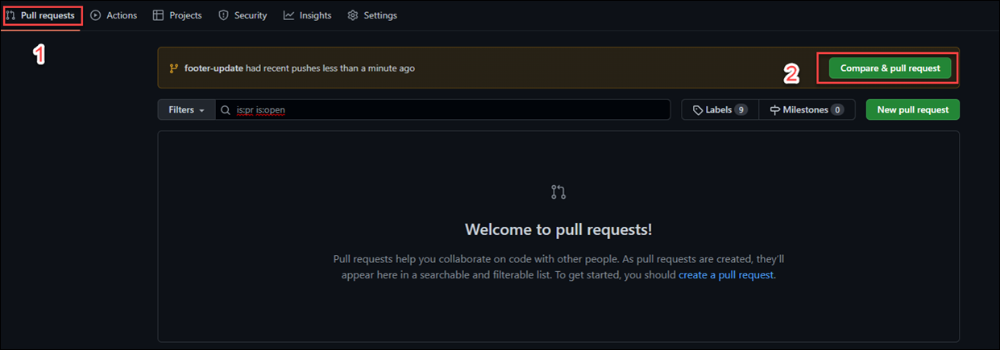

9. Change the base from microsoft/contosotraders to **YOURUSERNAME/contosotraders** and click **Create Pull Request**.  

    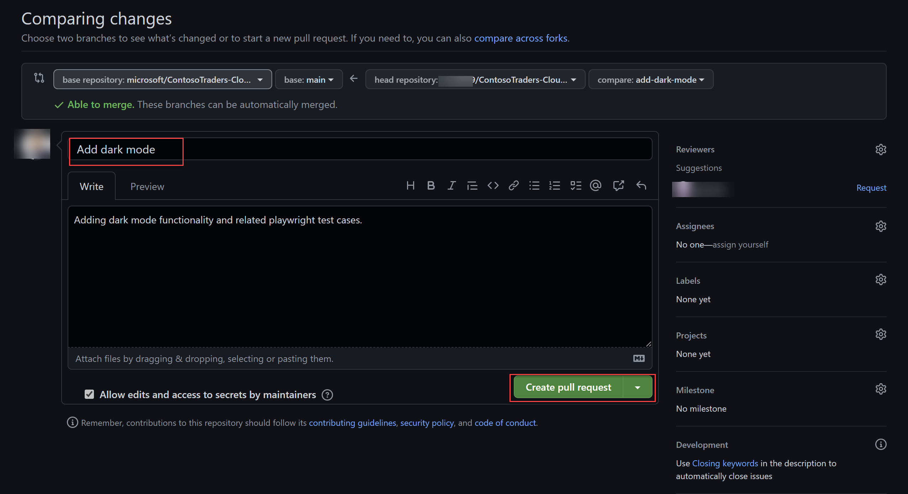

10. Merge the pull request to main branch.  

    

11. Merging the pull request should trigger your GitHub Action workflow, it will take few minutes for workflow to complete.  You can navigate inside the workflow to review progress, as documented in previous step.

    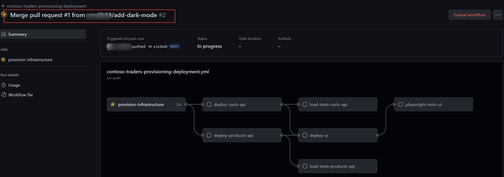

12. Once the workflow successfully completes, you can navigate to your Contoso Traders URL and see that the dark mode functionality is now added to the website.

    

## Summary

In this scenario, we looked at how GitHub Actions can incorporate entire lifecycle of application deployment, performance testing & testing with playwright as part of CI/CD cycle.

## Additional Reading  

Reference Links  

- [DevSecops in GitHub](https://learn.microsoft.com/azure/architecture/solution-ideas/articles/devsecops-in-github)
- [GitHub features and Actions](https://github.com/features/actions)
- [GitHub Advnced Security](https://docs.github.com/get-started/learning-about-github/about-github-advanced-security)
- [Microsoft Defender for DevOps - the benefits and features | Microsoft Learn](https://learn.microsoft.com/azure/defender-for-cloud/defender-for-devops-introduction)  
