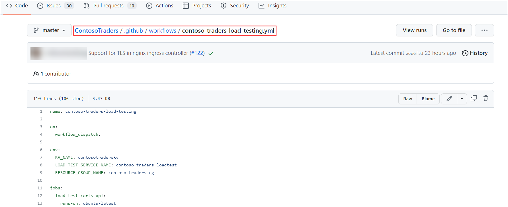
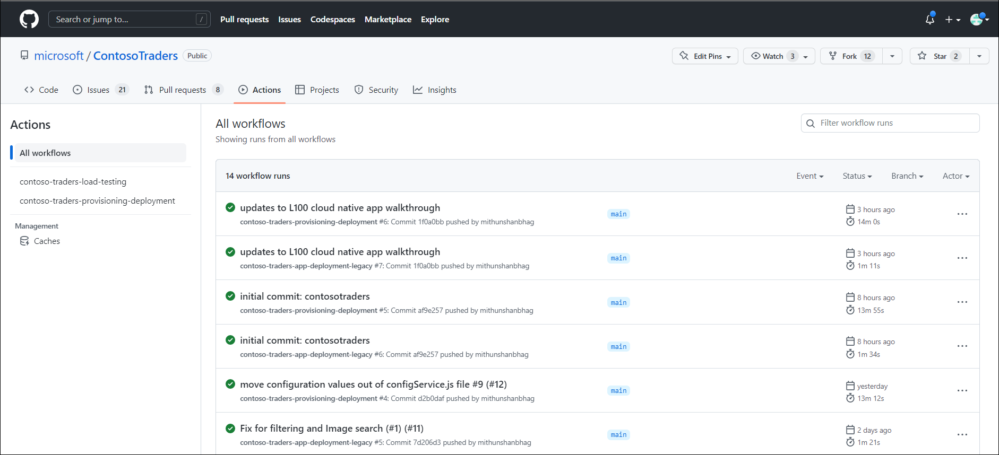
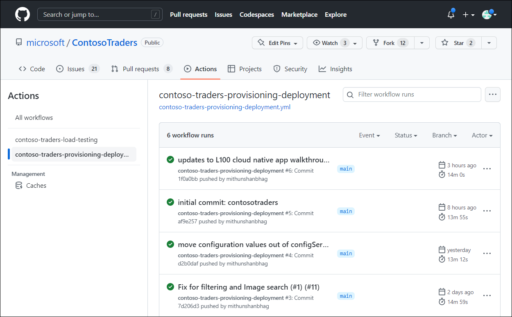
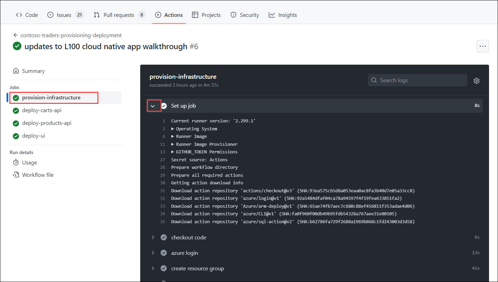
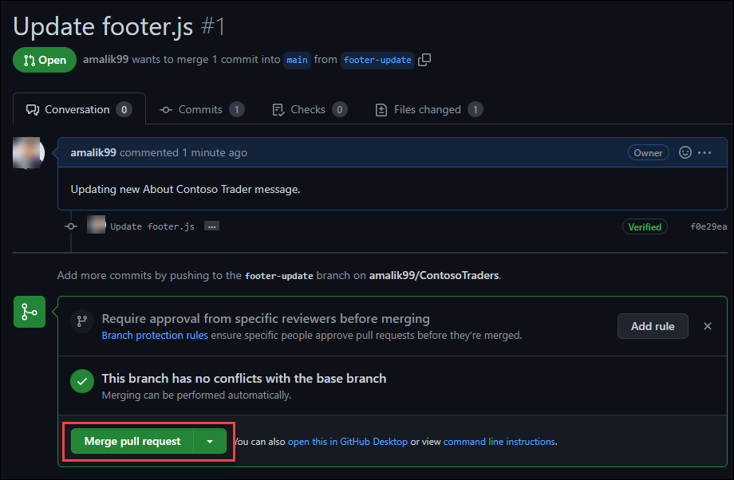

# DevOps with GitHub & Azure: Technical Walkthrough  

 
## Key Takeaways 

The key takeaways from this demo are: 

   - GitHub Actions is used to automate the deployment of the application and infrastructure. Using GitHub Action workflows, the application and infrastructure can be deployed to Azure cloud with a single click, allowing you to implement continuous integration and continuous deployment process.  
   - GitHub Actions integrates with Azure services to enable you to build, test, and deploy to Azure directly from your GitHub repository, along with tons of other integrations. 
   - Using GitHub Actions, you will be able to incorporate your application testing, performance testing to validate your application for production readiness as part of your DevOps process itself.  
   - As part of this demo script, you will be adding a new feature to enable dark mode capability on Contoso Traders Website, along with adding playwright based testing in your DevOps cycle. 
  
## Before you Begin 

You must have Contoso Traders deployed in your environment and setup with GitHub Actions.  Please refer to the deployment instructions [here](../demo-scripts/app-deployment-guide.md)

## Walkthrough – GitHub Actions for CI/CD 

 
GitHub Actions is a way to automate processes and workflows in your GitHub repository. Some of the benefits of using GitHub Actions include the ability to automate your software development lifecycle, integrate with other tools and services, including Azure services. 

Let us take a look at the GitHub Actions used by Contoso Traders for CI/CD. 

## Review Workflows used in Contoso Traders 

1. Navigate to [ContosoTraders](https://github.com/microsoft/ContosoTraders)

2. Go to the **github/workflows (1)** folder; inside, you'll find the workflow **YAML files (2)** that are used to deploy and set up the resources.  

    
    
3. Here is a quick overview of both workflows. If you are interested, you can review the workflow code to get into more details.  

    a. **Contoso-traders-provisioning-deployment:**  This workflow provisions Azure resources used for hosting the application and deploys the application and initial data to the provisioned resources. 

     It includes everything needed to get the application up and running in an Azure Environment.  

      

 
    b. **contoso-traders-load-testing:** This workflow runs a load testing against the ContosoTraders application using Azure Load Testing.  

      
      
## Monitor GitHub Actions Workflow 

GitHub Actions workflows can be monitored from the Actions tab on a repository. This tab shows a list of all the active and past workflows, along with their status and any associated logs. Users can see at a glance whether their workflows are running successfully and can troubleshoot any issues that may arise. Additionally, users can set up notifications to be alerted when a workflow starts or completes, or if it encounters an error. This can help users stay on top of their workflows and ensure that their projects are running smoothly. 

Let us take a look at the workflows status for Contoso Traders in this public repository.

1. Navigate to [ContosoTraders/Actions](https://github.com/microsoft/ContosoTraders/actions) 

    
    
2. Select the workflow **contoso-traders-provisioning-deployment**. This will the history of workflows execution.  

    

3. Select the latest run from the list. In Summary, you will see 4 jobs listed. 

    - Provision-infrastructure: Used for provisioning Azure resources, configure access policies and permissions, seeding initial database. 
    - deploy-carts-api: Used to deploy the Carts API in Azure Container Apps.  
    - deploy-products-api: Used to deploy Products API service in Azure Kubernetes Service. 
    - deploy-ui: Used to deploy the front end website to Azure App Service.  

    

4. Click on **provision-infrastructure** job. You can now see the detailed task of this job and expand to see the logs and steps.

   

  Similarly, you can review other jobs and workflows. Workflow are set to run on push to the main branch so that any new code change to the main branch is automatically built and deployed. 
  
## Demo – Experience GitHub Actions in Action  

Now that we have reviewed the GitHub Actions workflows, let us take a step-by-step approach to test the end-to-end CI/CD process.  

Let us take a fictious scenario, Contoso Traders marketing team requires changing the about section in footer.  

Currently, it is set to “Contoso Traders is an e-commerce platform that specializes in electronic items. Our website offers a wide range of electronics, including smartphones, laptops, and other popular gadgets.” 

 
  

Your marketing team requires changing this to following 

Contoso Traders is one stop shop for electronics items including smartphones, laptops, and other popular gadgets. Contoso Traders delivery premium quality electronics at affordable rates to resellers across the globe.  

Let us make the changes and experience magic of GitHub Actions.  

 

1. Login to your fork of Contoso Traders repository and navigate to Contoso Traders repository `https://github.com/**YOURGITHUBUSERNAME**/ContosoTraders`. 

2. Create a new branch **footer-update**.

    
    
3. Navigate to footer.js file, located in  **.src/ContosoTraders.Ui.Website/src/shared/footer/footer.js**

   
4. If you notice, the footer text is defined in **line#18 (1)**. Let us make an edit on this, click on edit **symbol (2)**.

    

5. Replace the text with new text received from Marketing team. Line 18 should look like below.  

    
Contoso Traders is one stop shop for electronics items including smartphones, laptops, and other popular gadgets. Contoso Traders delivery premium quality electronics at affordable rates to resellers across the globe.
 
    
6. Commit the change to footer-update branch. Click on Commit changes after updating commit message.  

     
     
7. Now, let us raise a pull request to merge this change to **main branch**. Click on **Pull Requests** and notice that changes are detected already. Click on **Review and raise Pull Request**.

    

8. Change the base from microsoft/contosotraders to **YOURUSERNAME/contosotraders** and click **Create Pull Request**.  

    

9. Merge the pull request to main branch.  

    

10. Merging the pull request should trigger your GitHub Action workflow, it will take few minutes for workflow to complete.  You can navigate inside the workflow to review progress, as documented in previous step.

    
    
11. Once the workflow successfully completes, you can navigate to your Contoso Traders Instance and see that the footer is updated on website.

## Walkthrough – GitHub Advanced Security  

 
GitHub Advanced Security is a set of features and tools that help users secure their repositories and protect their code. Some of its features include: 

   - Dependency scanning: This feature automatically scans dependencies for known vulnerabilities and alerts users when a vulnerable package is detected. 
   - Code scanning: This feature uses static analysis to detect potential security vulnerabilities in the code itself, and provides alerts and recommendations for how to fix the issues. 
   - Access control: This feature allows users to set up granular permissions and access controls for their repositories, so they can control who can view, push, and manage code. 
   - Secret scanning: This feature automatically scans repositories for potential secrets, such as API keys or password strings, and alerts users if any are detected.
   - DDoS protection: This feature provides additional protection against distributed denial of service (DDoS) attacks, which can disrupt access to repositories and make them unavailable. 

These features can help users secure their repositories and protect their code from a variety of potential threats. 

Let us look at some of the GitHub Advanced Security features in action on your Contoso Traders Public Repo.  

## Enable Dependabot in Contoso Traders 

Dependabot security updates make it easier for you to fix vulnerable dependencies in your repository. If you enable this feature, when a Dependabot alert is raised for a vulnerable dependency in the dependency graph of your repository, Dependabot automatically tries to fix it. 

Let us take a look at how dependabot can be used in Contoso Traders.   

1. Login to your fork of Contoso Traders repository and navigate to Contoso Traders repository `https://github.com/**YOURGITHUBUSERNAME**/ContosoTraders`. 

2. Navigate to settings > Security > Code Analysis and Security.

    
    
3. Enable following capabilities by clicking on enable button.  

     a. Dependabot alerts  
     b. Dependabot Security updates  
     c. Dependabot version updates  
     
     
 
4. Once enabled, dependabot will start scanning your repository for security issues. It will take few minutes before you start seeing alerts. 

5. You can navigate to Security > dependabot to see the alerts generated by Dependabot. Please note that these vulnerabilities are not fixed intentionally to demonstrate the dependabot features.  

    
    
6. Let us look at  **minimatch ReDoS vulnerability** . As you can see in screenshot it includes  details about vulnerability and suggested upgrade version. 

    
    
   GitHub Dependabot can also raise pull request automatically based on vulnerability detected along with selected versions. Let us take a look at one such pull request raised by dependabot. 

7. Navigate to Pull Requests on your repository, you should see that PRs are being submitted by dependabot. 

    
    
8. Open any of the pull request to review changes. You can also merge changes, which will fix the vulnerability and automatically push the changes with GitHub Actions.

    
    
You’ve now completed setup of GitHub Dependabot.  

 
## Review Secret Scanning in Contoso Traders 

GitHub scans repositories for known secret formats to prevent fraudulent use of credentials that were committed accidentally. Secret scanning happens by default on public repositories, and can be enabled on private repositories by repository administrators or organization owners. 

Let us setup Secret Scanning in your repository.  

1. Login to your fork of Contoso Traders repository and navigate to Contoso Traders repository `https://github.com/**YOURGITHUBUSERNAME**/ContosoTraders`. 

2. Navigate to settings > Security > Code Analysis and Security.

   
   
3. You will notice that Secret Scanning is already enabled. GitHub enables secret scanning by default for all Public repo. If you have a private repo, you can manually enable it from this page.  

   
   
4. GitHub will detect any secrets being pushed to your repo and notifies you via alerts.

## Microsoft Defender for Cloud with GitHub Advanced Security  

Microsoft Defender for Cloud is a Cloud Security Posture Management (CSPM) and Cloud Workload Protection Platform (CWPP) for all of your Azure, on-premises, and multicloud (Amazon AWS and Google GCP) resources. 

Microsoft Defender integrates with GitHub Advanced Security to provide and end to end DevSecOps solution.  

By connecting your GitHub repositories to Defender for Cloud, you'll extend Defender for Cloud's enhanced security features to your GitHub resources. These features include: 

   - **Defender for Cloud's Cloud Security Posture Management (CSPM) features** - Assesses your GitHub resources according to GitHub-specific security recommendations. You can also learn about all of the [recommendations for DevOps](https://learn.microsoft.com/en-us/azure/defender-for-cloud/recommendations-reference) resources. Resources are assessed for compliance with built-in standards that are specific to DevOps. Defender for Cloud's [asset inventory page](https://learn.microsoft.com/en-us/azure/defender-for-cloud/asset-inventory) is a multicloud enabled feature that helps you manage your GitHub resources alongside your Azure resources. 

  - **Defender for Cloud's Cloud Workload Protection features** - Extends Defender for Cloud's threat detection capabilities and advanced defenses to your GitHub resources. 

## Connect Microsoft Defender for Cloud with GitHub Repo 

Let us setup Microsoft Defender for Cloud with your GitHub repository.   

1. Sign in to the Azure portal. 

2. Navigate to Microsoft Defender for Cloud > Environment Settings. 

3. Select Add environment. 

4. Select GitHub. 

   
   
5. Provide following details. 

    - Name: 
    - Select your subscription 
    - Create a new RG or select your existing contoso-traders-rg 

    
    
6. Select the Microsoft Defender Plan and turn on for DevOps. 

    
    
7. In next step, authorize to your GitHub repository using your GitHub Credentials and install the Microsoft Defender app. 

    
    
8. Login with your GitHub account and authorize **Microsoft Security DevOps**. 

    
    
9. Once authorized, you will have option to install the app. Click Install and select your ContosoTraders repository to install the app. Click Install.

   
   
10. Review and Click Create to complete the deployment.  

    
   
    You have not completed linking your GitHub Repositories Advanced Security with Microsoft Defender for Cloud – DevOps. 

    Next take a look at some of the recommendations.  
    
## Review Microsoft Defender for Cloud Recommendations  

Once you setup Microsoft Defender for Cloud, it may take few hour to sync and generate recommendations.  

Let us take a look at some the recommendations generated.  

 
1. Login to Azure Portal and navigate to Microsoft Defender for Cloud. 

   
   
2. Click on Recommendations, it should list out security recommendations based on Contoso Traders deployment in your environment.
 
   
   
3. Let us take a look at some of the recommendations, expand **Remediate vulnerabilities**.

    
    
4. If you expand on any of the recommendation, it will include details about the vulnerability and remediation steps.  

      
   
5. Microsoft Defender for Cloud can also automatically remediate various recommendations with one click.  

6. You may explore and remediate other recommendation similarly.  

7. GitHub Advanced security alerts and recommendations are available in Defender for Cloud > DevOps Security.

    
   
   
## Summary 

In this scenario, we looked at how GitHub Actions and Advanced Security features can help organizations build an effective DevSecOps process, enhancing overall productivity and security posture of software development lifecycle. 

We also looked at Microsoft Defender for Cloud integration with GitHub.  
  
## Additional Reading  

Reference Links  

 - [DevSecops in GitHub](https://learn.microsoft.com/en-us/azure/architecture/solution-ideas/articles/devsecops-in-github) 
 - [GitHub features and Actions](https://github.com/features/actions) 
 - [GitHub Advnced Security](https://docs.github.com/en/get-started/learning-about-github/about-github-advanced-security)
 - [Microsoft Defender for DevOps - the benefits and features | Microsoft Learn](https://learn.microsoft.com/en-us/azure/defender-for-cloud/defender-for-devops-introduction)  
