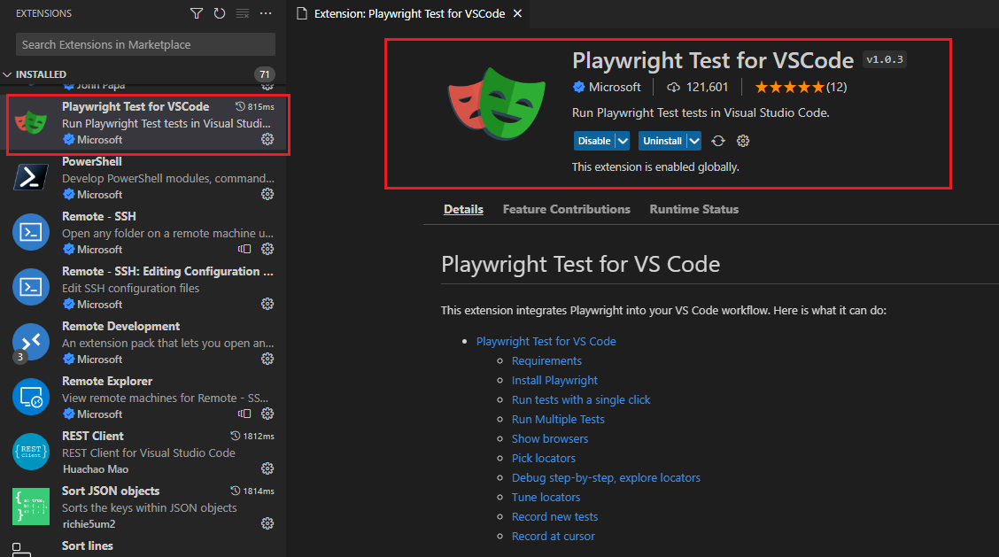
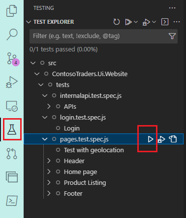
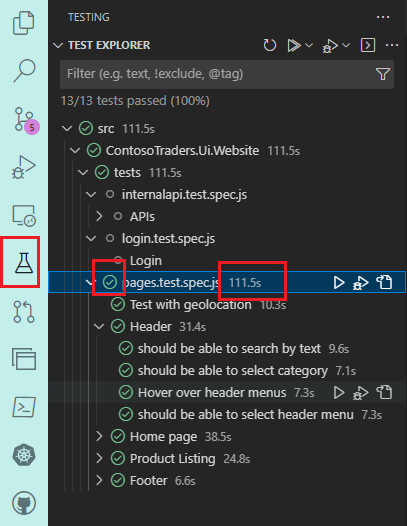
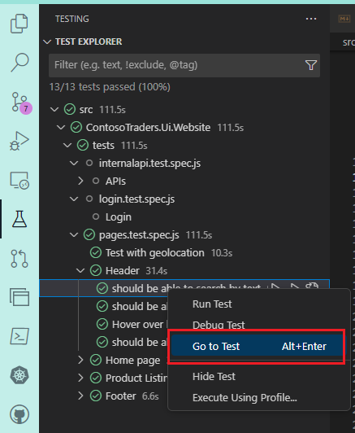
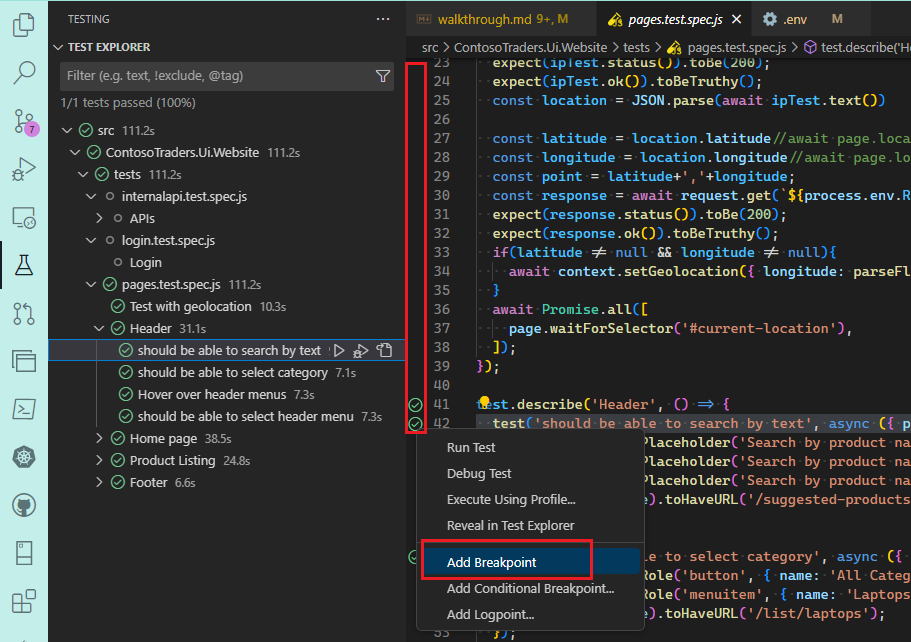
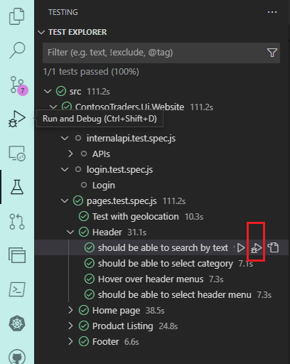
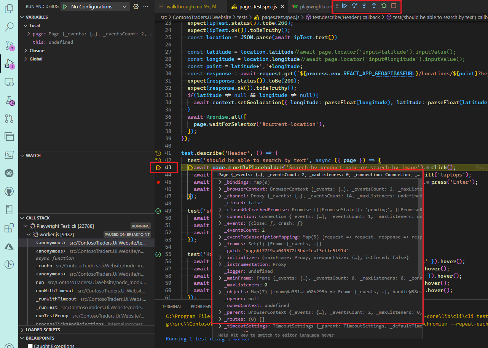

# Testing with Playwright: Overview

## Key Takeaways

## Before You Begin

1. Please execute the steps outlined in the [deployment instructions](../../docs/deployment-instructions.md) to provision the infrastructure in your own Azure subscription.

2. Once done, please execute the steps mentioned in the [running locally](../../docs/running-locally.md) document. Basically this will ensure that Playwright is installed on your machine.

## Installing VSCode Extension

You can install the Playwright extension for VSCode from the marketplace ([LINK](https://marketplace.visualstudio.com/items?itemName=ms-playwright.playwright)). This extension will help you get started with Playwright quickly. It will also help you run and debug your tests from within VSCode.

  

## Running tests in VSCode

1. Click on the `Testing` tab in VSCode's activity bar. This will show you all the tests in your project (in a tree structure).

   

2. You can run a single test (or a group of tests) by clicking the triangle symbol next to it. When Playwright finishes executing the test(s), you will see a green tick next to your test block as well as the time it took to run the test.

   

3. You can navigate to the test code by right-clicking on the test name in the tree structure, selecting `Go To Test`.

   

## Debugging the tests

1. You can set breakpoints in your test code by clicking on the left "gutter" (the left-most column in the code editor). Right-clicking in the gutter will show you more options (like setting a conditional breakpoint).

   

2. Then you can run a test in debug mode by clicking on the `Debug` button next to the test name in the tree structure.

   

3. Once the breakpoint is hit, you can use the single-step through the code and inspect variables (Note: These debugging features are already built into VSCode, and aren't playwright specific. [More details](https://code.visualstudio.com/docs/editor/debugging)).

   

## Testing with Azure AD

In order to test authentication, we can configure AAD, then run tests to log in to a Contoso Traders account. The specific steps are:

1. Identify the Service Principal details created in the [deployment instructions](../../docs/deployment-instructions.md).

2. Add the above Service Principal into the the [Application Administrator](https://learn.microsoft.com/en-us/azure/active-directory/roles/permissions-reference#application-administrator) active directory role.

   1. Go to the Azure portal, and navigate to the Azure Active Directory blade. Then click on the `Roles and Administrators` tab on the left.
   2. Select the `Application Administrator` role, and click on the `Add assignments` button.
   3. Select the service principal that you created in the previous step. Click on the `Add` button.

   

   >
   > Notes:
   >
   > * Unfortunately, there is no AZ CLI, AZ PowerShell or Bicep template support to add a service principal to the `Application Administrator` role. You'll have to do this manually through the Azure portal.
   > * Note: In order for you to add the service principal to the `Application Administrator` role, you must yourself be a member of the `Global Administrator` role in Azure Active Directory.
   >

3. Create a test account (MFA disabled).

4. To run the [example test](../../src/ContosoTraders.Ui.Website/tests/account.ts) in GitHub Actions, add the test account credentials as github environment-level variables.

   | Variable Name | Variable Value               |
   | ------------- | ---------------------------- |
   | `AADUSERNAME` | username of the test account |
   | `AADPASSWORD` | password of the test account |

   > If you wish to run the [example test](../../src/ContosoTraders.Ui.Website/tests/account.ts) locally, set the credentials as 2 environment variables: REACT_APP_AADUSERNAME and REACT_APP_AADPASSWORD

5. Re-run the github workflow `contoso-traders-cloud-testing`. This will configure the Azure AD to enable login functionality in the app.

   This test has a beforeAll hook that will log in to the app, then the test case uses the logged in state to fill out the personal info form.

6. Read the [Playwright Authentication Documentation](https://playwright.dev/docs/auth)

> Tests written with Playwright execute in isolated clean-slate environments called browser contexts. This isolation model improves reproducibility and prevents cascading test failures. New browser contexts can load existing authentication state. This eliminates the need to login in every context and speeds up test execution.

## More Information

* [Playwright Documentation](https://playwright.dev/)
* [Using the Playwright VSCode Extension](https://playwright.dev/docs/getting-started-vscode)
* [VSCode Debugging](https://code.visualstudio.com/docs/editor/debugging)
