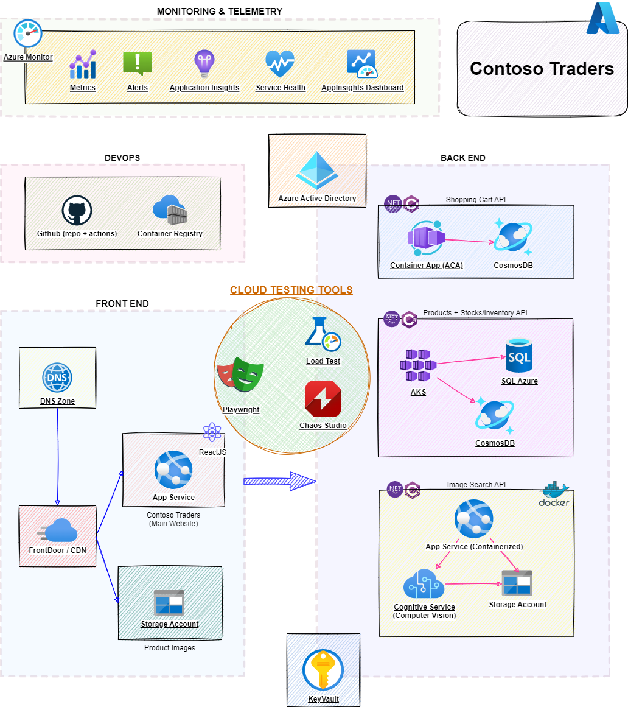

# ContosoTraders - Deployment Instructions

This document will help you deploy the Contoso Traders application in your Azure environment. You'll be using both GitHub actions and Azure CLI for this.

Once deployed, you'll be able to walk through various demo scenarios for Microsoft Playwright, Azure Load Testing, and Azure Chaos Studio.

## Prerequisites

You will need following to get started:

* A GitHub Account: You can create one for free [here](https://github.com/).
* An Azure Subscription: You can create a free account [here](https://azure.microsoft.com/free/).
* Azure CLI: Instructions to download and install are available [here](https://learn.microsoft.com/en-us/cli/azure/install-azure-cli).

## Prepare your Azure Subscription

* Log into Azure CLI with your Azure credentials: `az login`
  * If your organization has MFA enabled, then you'll need to log into the Azure CLI as follows: `az login --tenant <AZURE-TENANT-ID>`. Replace `<AZURE-TENANT-ID>` with your Azure tenant ID.

* Ensure that the correct Azure subscription is selected: `az account show`
  * If not, select the correct subscription: `az account set -s <AZURE-SUBSCRIPTION-ID>`. Replace `<AZURE-SUBSCRIPTION-ID>` with your Azure subscription ID.

* Register some required resource providers in your Azure subscription:
  * `az provider register -n Microsoft.OperationsManagement -c`
  * `az provider register -n Microsoft.Cdn -c`

* Create an Azure Service Principal and add it the `Owner` role in your Azure subscription:
  * `az ad sp create-for-rbac -n contosotraders-sp --role Owner --scopes /subscriptions/<AZURE-SUBSCRIPTION-ID> --sdk-auth`. Replace `<AZURE-SUBSCRIPTION-ID>` with your Azure subscription ID.
  * Please make a note of the JSON output from above step (especially the `clientId`, `clientSecret`, `subscriptionId` and `tenantId` properties). These will be required later.

## Prepare your GitHub Account

* First, fork the [contosotraders-cloudtesting repo](https://github.com/microsoft/contosotraders-cloudtesting) in your account.

* Then, set up the repository secrets in your forked repo. On your fork of the github repository, go to the `Settings` tab > `Secrets` > `Actions` and create these necessary repository secrets:

  | Secret Name        | Secret Value                                                                   |
  | ------------------ | ------------------------------------------------------------------------------ |
  | `ENVIRONMENT`      | A unique environment name (max 6 characters, alphanumeric only). E.g. 'test51' |
  | `SQL_PASSWORD`     | A password which will be set on all SQL Azure DBs                              |
  | `SERVICEPRINCIPAL` | See details below                                                              |

  The value of the `SERVICEPRINCIPAL` secret above needs to have the below format.

  ```json
  {
    "clientId": "zzzzzzzz-zzzz-zzzz-zzzz-zzzzzzzzzzzz",
    "clientSecret": "your-client-secret",
    "tenantId": "zzzzzzzz-zzzz-zzzz-zzzz-zzzzzzzzzzzz",
    "subscriptionId": "zzzzzzzz-zzzz-zzzz-zzzz-zzzzzzzzzzzz"
  }
  ```

  The values of the properties needed can be found in the JSON output of the `az ad sp create-for-rbac` command in the previous section.

## Deploy the Application

* Go to your forked repo's `Actions` tab, selecting the `contoso-traders-provisioning-deployment` workflow, and click on the `Run workflow` button.

* This github workflow will provision the necessary infrastructure to your Azure subscription as well as deploy the applications (APIs, UI) to the infrastructure. Note that the workflow might take about 15 mins to complete.

  

## Verify the Deployment

* Once the workflow completes, the UI's accessible CDN endpoint will be displayed in the workflow logs (in the `display ui cdn endpoint` step in the `provision-infrastructure` job).

  

  The UI's endpoint will be partially masked in the logs. Replace the `***` token with the value of the `ENVIRONMENT` github repository secret.

* You can load the UI endpoint in your browser to verify that the application is indeed up and running.

### Troubleshooting Deployment Errors

@TODO

## Explore Demo Scenarios

For further learning, you can run through some of the demo scripts listed below:

* [Developer Workflow](../demo-scripts/dev-workflow/walkthrough.md)
* [Azure Load Testing](../demo-scripts/azure-load-testing/walkthrough.md)
* [Azure Chaos Studio](../demo-scripts/azure-chaos-studio/walkthrough.md)
* [Testing with Playwright](../demo-scripts/testing-with-playwright/walkthrough.md)

## Cleanup

Once you are done deploying, testing, exploring, you should delete the provisioned resources to prevent incurring additional costs.

Once done, you can safely delete the `contoso-traders-rg` resource group. The `contoso-traders-aks-nodes-rg` will be automatically deleted as part of the AKS cluster deletion.
