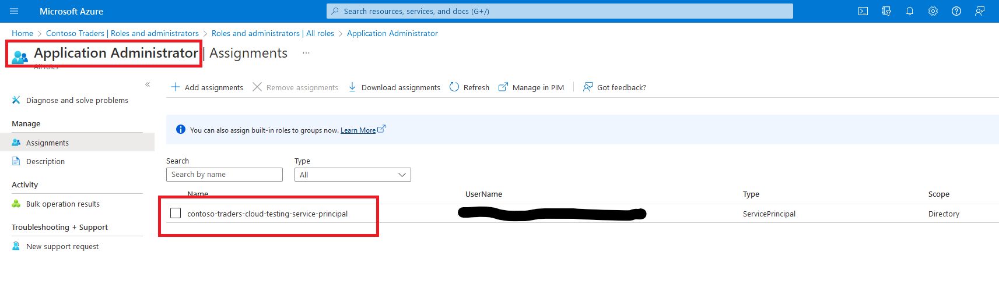

# ContosoTraders - Deployment Instructions

This document will help you deploy the ContosoTraders application in your Azure environment. You'll be using both GitHub actions and Azure CLI for this.

Once deployed, you'll be able to walk through various demo scenarios for Microsoft Playwright, Azure Load Testing, and Azure Chaos Studio.

## Prerequisites

You will need following to get started:

* A GitHub Account: You can create one for free [here](https://github.com/).
* An Azure Subscription: You can create a free account [here](https://azure.microsoft.com/free/).
* Azure CLI: Instructions to download and install are available [here](https://learn.microsoft.com/en-us/cli/azure/install-azure-cli).

## Prepare your Azure Subscription

* Log into Azure CLI with your Azure credentials: `az login`
  * If your organization has MFA enabled, then you'll need to log into the Azure CLI as follows: `az login --tenant <AZURE-TENANT-ID>`. Replace `<AZURE-TENANT-ID>` with your Azure tenant ID.

* Ensure that the correct Azure subscription is selected: `az account show`
  * If not, select the correct subscription: `az account set -s <AZURE-SUBSCRIPTION-ID>`. Replace `<AZURE-SUBSCRIPTION-ID>` with your Azure subscription ID.

* Register some required resource providers in your Azure subscription:
  * `az provider register -n Microsoft.OperationsManagement -c`
  * `az provider register -n Microsoft.Cdn -c`
  * `az provider register -n Microsoft.Chaos -c`

* Create an Azure Service Principal and add it the `Owner` role in your Azure subscription:
  * `az ad sp create-for-rbac -n contosotraders-sp --role Owner --scopes /subscriptions/<AZURE-SUBSCRIPTION-ID> --sdk-auth`. Replace `<AZURE-SUBSCRIPTION-ID>` with your Azure subscription ID.
  * Please make a note of the JSON output from above step (especially the `clientId`, `clientSecret`, `subscriptionId` and `tenantId` properties). These will be required later.

* Add the above Service Principal into the the [Application Administrator](https://learn.microsoft.com/en-us/azure/active-directory/roles/permissions-reference#application-administrator) active directory role.
  * Go to the Azure portal, and navigate to the Azure Active Directory blade. Then click on the `Roles and Administrators` tab on the left.
  * Select the `Application Administrator` role, and click on the `Add assignments` button.
  * Select the service principal that you created in the previous step. Click on the `Add` button.

  

>
> Notes:
>
> * Unfortunately, there is no AZ CLI, AZ PowerShell or Bicep template support to add a service principal to the `Application Administrator` role. You'll have to do this manually through the Azure portal.
> * Note: In order for you to add the service principal to the `Application Administrator` role, you must yourself be a member of the `Global Administrator` role in Azure Active Directory.
>

## Prepare your GitHub Account

* First, fork the [contosotraders-cloudtesting repo](https://github.com/microsoft/contosotraders-cloudtesting) in your account.

* Then, set up the repository secrets in your forked repo. On your fork of the github repository, go to the `Settings` tab > `Secrets and variables` > `Actions` > `Secrets` tab and create these necessary repository secrets:

  | Secret Name        | Secret Value                                      |
  | ------------------ | ------------------------------------------------- |
  | `SQL_PASSWORD`     | A password which will be set on all SQL Azure DBs |
  | `SERVICEPRINCIPAL` | See details below                                 |

  The value of the `SERVICEPRINCIPAL` secret above needs to have the below format.

  ```json
  {
    "clientId": "zzzzzzzz-zzzz-zzzz-zzzz-zzzzzzzzzzzz",
    "clientSecret": "your-client-secret",
    "tenantId": "zzzzzzzz-zzzz-zzzz-zzzz-zzzzzzzzzzzz",
    "subscriptionId": "zzzzzzzz-zzzz-zzzz-zzzz-zzzzzzzzzzzz"
  }
  ```

  The values of the properties needed can be found in the JSON output of the `az ad sp create-for-rbac` command in the previous section.

* Then, create two [environments for deployment](https://docs.github.com/en/actions/deployment/targeting-different-environments/using-environments-for-deployment). On your fork of the github repository, go to the `Settings` tab > `Environments` > Click on `New Environment` button and create the following two environments:
  * `staging`
  * `production` (optional)

* Then, for each of these above environments, create this environment variable:

  | Variable Name | Variable Value                                                                               |
  | ------------- | -------------------------------------------------------------------------------------------- |
  | `SUFFIX`      | A unique environment suffix (max 6 characters, alphanumeric, lower case only). E.g. 'test51' |

## Deploy the Application

* Go to your forked repo's `Actions` tab, selecting the `contoso-traders-cloud-testing` workflow, and click on the `Run workflow` button.

* This github workflow will provision the necessary infrastructure to your Azure subscription as well as deploy the applications (APIs, UI) to the infrastructure. Note that the workflow might take about 15 mins to complete.

  

## Verify the Deployment

* Once the workflow completes, the UI's accessible CDN endpoint will be displayed in the workflow logs (in the `display ui cdn endpoint` step in the `provision-infrastructure` job).

  

* You can load the UI endpoint in your browser to verify that the application is indeed up and running.

### Troubleshooting Deployment Errors

Here are some common problems that you may encounter during deployment:

1. AI Terms and services: If you see an error stating that "Responsible AI terms are not accepted for this subscription", you'll have to manually create an Azure Cognitive Service resource in your subscription temporarily, and accept the Responsible AI terms. Once created, you can then re-run the workflow job.

   * The Responsible AI terms are shown only once per subscription (during first Cognitive Service resource creation in subscription), and once accepted, they are not shown again.
   * Currently, there exists no mechanism to accept the Responsible AI terms programmatically. It can only be done manually through the Azure portal.
   * You can read more about Responsible AI [here](https://learn.microsoft.com/en-us/azure/machine-learning/concept-responsible-ai).

2. Other intermittent errors: Should you encounter any of [these intermittent errors](https://github.com/microsoft/ContosoTraders/issues?q=is%3Aissue+is%3Aopen+label%3Adevops) in the github workflow, please re-run the failed jobs (it'll will pass on retry). We're working to fix these soon.

## Explore Demo Scenarios

For further learning, you can run through some of the demo scripts listed below:

* [Developer Workflow](../demo-scripts/dev-workflow/walkthrough.md)
* [Azure Load Testing](../demo-scripts/azure-load-testing/walkthrough.md)
* [Azure Chaos Studio](../demo-scripts/azure-chaos-studio/walkthrough.md)
* [Testing with Playwright](../demo-scripts/testing-with-playwright/walkthrough.md)

## Cloud Costs and Cleanup

Once you are done deploying, testing, exploring, you should delete the provisioned resources to prevent incurring additional costs.

Once done, you can safely delete the `contoso-traders-rg` resource group. The `contoso-traders-aks-nodes-rg` will be automatically deleted as part of the AKS cluster deletion.

> A quick note on costs considerations when you deploy the application to your Azure subscription:
>
> 1. Azure Load Testing ([pricing details](https://azure.microsoft.com/en-us/pricing/details/load-testing/)): The number of virtual users and duration of the test are the key factors that determine the cost of the test. In this demo, the load tests are configured to use 5 virtual users and the test is set to run for 3 mins.
> 2. Azure Kubernetes Service ([pricing details](https://azure.microsoft.com/en-us/pricing/details/kubernetes-service/)): The number of nodes and the number of hours that the cluster is running are the key factors that determine the cost of the cluster. In this demo, the cluster is configured to use 3 nodes (powered by vm scale sets) and the cluster is set to run 24x7.
> 3. Azure Container Apps ([pricing details](https://azure.microsoft.com/en-us/pricing/details/container-apps/)): Each instance has 0.5 vCPU and 1.0 GiB of memory. In this demo, the container app is configured to use 1 instance, but can autoscale out to max 10 instances under load.
> 4. Azure Virtual Machines ([pricing details](https://azure.microsoft.com/en-us/pricing/details/virtual-machines/windows/)): The jumpbox VM uses the `Standard_D2s_v3` VM size, which has 2 vCPU and 8 GiB of memory. The jumpbox VMs are set to run 24x7.
> 5. Github Actions / storage quota ([pricing details](https://docs.github.com/en/billing/managing-billing-for-github-actions/about-billing-for-github-actions#included-storage-and-minutes)): We've set the playwright test to enable recordings only on failures/retries. This brings the playwright report to ~55 MB when tests fail.
>
> The above costs are based on the default configuration of the demo. You can modify the configuration to reduce the costs. For example, you can reduce the number of nodes in the AKS cluster, reduce the number of instances in the container app, reduce the number of virtual users in the load test, etc.
>
