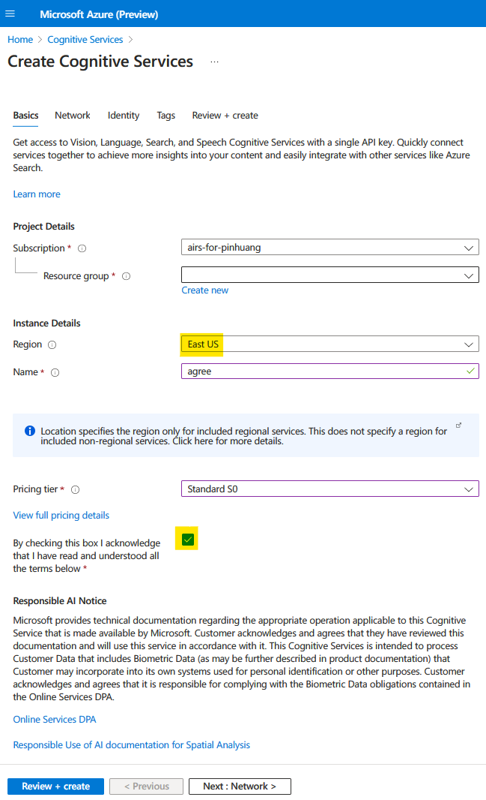
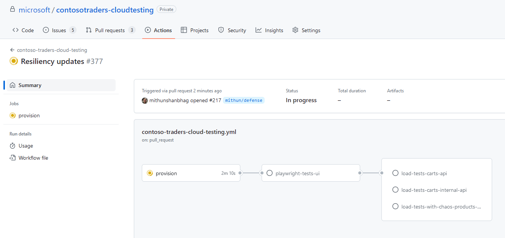
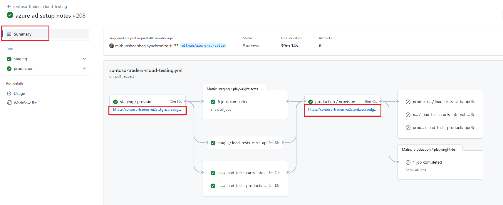
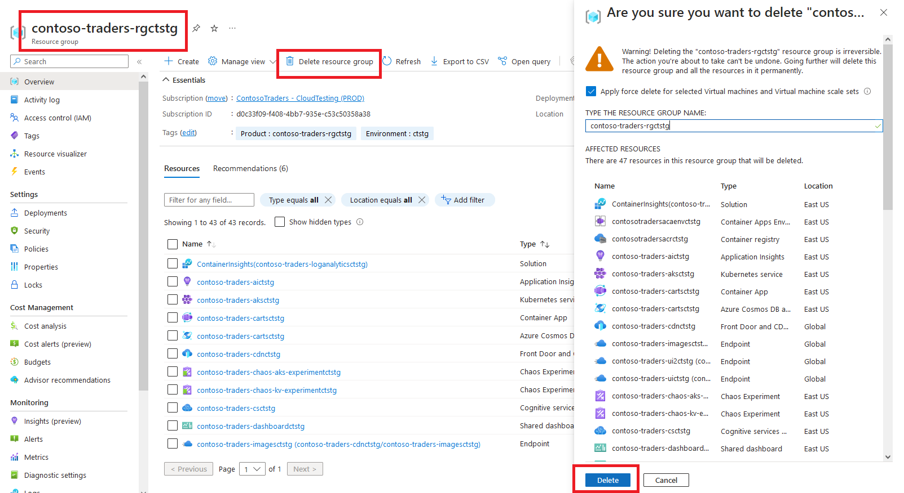

# Contoso Traders - Deployment instructions

This document will help you deploy the Contoso Traders application in your Azure environment. You'll be using both GitHub Actions and Azure CLI for this.

Once deployed, you'll be able to walk through various demo scenarios for Microsoft Playwright, Azure Load Testing, and Azure Chaos Studio.

## Prerequisites

You will need following to get started:

1. **GitHub account**: Create a free account [here](https://github.com/).
2. **Azure subscription**: Create a free account [here](https://azure.microsoft.com/free/).
3. **Azure CLI**: Instructions to download and install [here](https://learn.microsoft.com/cli/azure/install-azure-cli).
4. **VS Code**: Download and install [here](https://code.visualstudio.com/download).

## Prepare your Azure Subscription

1. Log into Azure CLI with your Azure credentials: `az login`

2. Ensure that the correct Azure subscription is selected: `az account show`
   * If not, select the correct subscription: `az account set -s <AZURE-SUBSCRIPTION-ID>`. Replace `<AZURE-SUBSCRIPTION-ID>` with your Azure subscription ID.

3. Register some required resource providers in your Azure subscription:
   * `az provider register -n Microsoft.OperationsManagement -c`
   * `az provider register -n Microsoft.Cdn -c`
   * `az provider register -n Microsoft.Chaos -c`

4. Create an Azure Service Principal and add it to the `Owner` role in your Azure subscription:
   * `az ad sp create-for-rbac -n contosotraders-sp --role Owner --scopes /subscriptions/<AZURE-SUBSCRIPTION-ID> --sdk-auth`. Replace `<AZURE-SUBSCRIPTION-ID>` with your Azure subscription ID.
   * Make a note of the JSON output from above step (especially the `clientId`, `clientSecret`, `subscriptionId` and `tenantId` properties). These will be required later.
   * You'll notice a warning in the output: `Option '--sdk-auth' has been deprecated and will be removed in a future release`. This is [a known issue, without workarounds, but can be safely ignored](https://github.com/Azure/azure-cli/issues/20743).

5. If for some reason, you do not have permissions to add the service principal in the `Owner` role on the subscription, then you can create a custom role and assign it to the service principal as follows (remember to replace `<AZURE-SUBSCRIPTION-ID>` in snippets below with your Azure subscription ID).

   1. If using bash:

      ```bash
      az role definition create --role-definition '{
          "Name": "ContosoTraders Write Role Assignments",
          "Description": "Perform Role Assignments",
          "Actions": ["Microsoft.Authorization/roleAssignments/write"],
          "AssignableScopes": ["/subscriptions/<AZURE-SUBSCRIPTION-ID>"]
      }'
      ```

   2. If using PowerShell or cmd shell, you can run `az role definition create --role-definition ./custom-role.json`. Note that you need to first create a file called `custom-role.json` containing the following snippet.

      ```json
      {
          "Name": "ContosoTraders Write Role Assignments",
          "Description": "Perform Role Assignments",
          "Actions": ["Microsoft.Authorization/roleAssignments/write"],
          "AssignableScopes": ["/subscriptions/<AZURE-SUBSCRIPTION-ID>"]
      }
      ```

   3. Finally create the service principal and assign it to the custom role:

      ```bash
      `az ad sp create-for-rbac -n contosotraders-sp --role "ContosoTraders Write Role Assignments" --scopes /subscriptions/<AZURE-SUBSCRIPTION-ID> --sdk-auth`
      ```

6. If you haven't used Azure Cognitive Services with your subscription, you'll need to accept the responsible AI terms.
Manually create an Azure Cognitive Service resource in your subscription temporarily, and accept the Responsible AI terms. You can then delete the resource.

   * The Responsible AI terms are shown only once per subscription (during first Cognitive Service resource creation in subscription), and once accepted, they are not shown again.
   * Currently, there exists no mechanism to accept the Responsible AI terms programmatically. It can only be done manually through the Azure portal.
   * You can read more about Responsible AI [here](https://learn.microsoft.com/azure/machine-learning/concept-responsible-ai).

   

## Prepare your GitHub Repository

1. Fork the [contosotraders-cloudtesting repo](https://github.com/microsoft/contosotraders-cloudtesting) in your account.

## Prepare your GitHub Workflow for Deployment

>
>If you wish to deploy using Azure Pipelines instead of GitHub Workflows, you can follow the instructions [here](./deployment-instructions-azure-pipelines.md) and skip this section entirely.
>

1. Set up the repository secrets in your forked repo. On your fork of the github repository, go to the `Settings` tab > `Secrets and variables` > `Actions` > `Secrets` tab and create these necessary repository secrets:

    | Secret Name        | Secret Value                                                                       |
    | ------------------ | ---------------------------------------------------------------------------------- |
    | `SQLPASSWORD`      | 8 to 15 characters long, must contain uppercase, lowercase, and numeric characters |
    | `SERVICEPRINCIPAL` | See details below                                                                  |

    The value of the `SERVICEPRINCIPAL` secret above needs to have the below format.

   ```json
   {
     "clientId": "zzzzzzzz-zzzz-zzzz-zzzz-zzzzzzzzzzzz",
     "clientSecret": "your-client-secret",
     "tenantId": "zzzzzzzz-zzzz-zzzz-zzzz-zzzzzzzzzzzz",
     "subscriptionId": "zzzzzzzz-zzzz-zzzz-zzzz-zzzzzzzzzzzz"
   }
   ```

    The values of the properties needed can be found in the JSON output of the `az ad sp create-for-rbac` command in the previous section.

2. Set up the repository variables in your forked repo. On your fork of the github repository, go to the `Settings` tab > `Secrets and variables` > `Actions` > `Variables` tab and create these necessary repository variables:

    | Variable Name      | Variable Value                                                                                                                                                                              |
    | ------------------ | ------------------------------------------------------------------------------------------------------------------------------------------------------------------------------------------- |
    | `SUFFIX`           | A unique environment suffix (max 6 characters, alphanumeric, lower case only, no whitespace, no special chars). E.g. 'test51' or '1stg'                                                     |
    | `DEPLOYMENTREGION` | The Azure region to deploy the application in. Must be one of: `australiaeast`,`centralus`,`eastus`,`eastus2`,`japaneast`,`northcentralus`,`uksouth`,`westcentralus`,`westeurope` |

3. (optional) if you would like to deploy the additional resources to test private endpoints, set the following variable:'

    | Variable Name      | Variable Value                                                                                                                                                                              |
    | ------------------ | ------------------------------------------------------------------------------------------------------------------------------------------------------------------------------------------- |
    | `DEPLOYPRIVATEENDPOINTS`           | `true`

### Deploy the Application

1. Go to your forked repo's `Actions` tab, selecting the `contoso-traders-cloud-testing` workflow, and click on the `Run workflow` button.

2. This github workflow will provision the necessary infrastructure to your Azure subscription as well as deploy the applications (APIs, UI) to the infrastructure. Note that the workflow might take about 15 mins to complete.

  

### Verify the Deployment

1. Once the workflow completes, the UI's accessible CDN endpoint URL will be displayed in the github workflow run.

    

2. Clicking on the URL above, will load the application in a new browser tab. You can then verify that the application is indeed up and running.

### Troubleshooting Deployment Errors

Here are some common problems that you may encounter during deployment:

1. Intermittent errors: Should you encounter any of [these intermittent errors](https://github.com/microsoft/ContosoTraders/issues?q=is%3Aissue+is%3Aopen+label%3Adevops) in the github workflow, please re-run the failed jobs (it'll will pass on retry). We're working to fix these soon.

2. There is a [known issue](https://github.com/Azure/login/issues/249) where the Azure login github action fails if the service principal's `clientSecret` begins with `-` (hyphen). If you encounter this, please regenerate a new secret, update the repository secret in your github fork, and restart the workflow.

## Explore Demo Scenarios

For further learning, you can run through some of the demo scripts listed below:

* [Developer workflow](../demo-scripts/dev-workflow/walkthrough.md)
* [Azure Load Testing](../demo-scripts/azure-load-testing/walkthrough.md)
* [Azure Chaos Studio](../demo-scripts/azure-chaos-studio/walkthrough.md)
* [UI Testing with Playwright](../demo-scripts/testing-with-playwright/walkthrough.md)

## Cleanup

Once you are done deploying, testing, exploring, you should delete the `contoso-traders-rg{SUFFIX}` resource group to prevent incurring additional costs.

  

The `contoso-traders-aks-nodes-rg{SUFFIX}` will be automatically deleted as part of the AKS cluster deletion.

## Cost Considerations

A quick note on costs considerations when you deploy the application to your Azure subscription:

1. Azure Load Testing ([pricing details](https://azure.microsoft.com/pricing/details/load-testing/)): The number of virtual users and duration of the test are the key factors that determine the cost of the test. In this demo, the load tests are configured to use 5 virtual users and the test is set to run for 3 mins.
2. Azure Kubernetes Service ([pricing details](https://azure.microsoft.com/pricing/details/kubernetes-service/)): The number of nodes and the number of hours that the cluster is running are the key factors that determine the cost of the cluster. In this demo, the cluster is configured to use 1 node (powered by vm scale sets) and the cluster is set to run 24x7 (you can manually stop the cluster when not in use). Because of a [limitation in the AKS bicep schema](https://github.com/Azure/bicep/issues/6974), the AKS cluster has to use premium SSD storage disks.
3. Azure Container Apps ([pricing details](https://azure.microsoft.com/pricing/details/container-apps/)): Each instance has 0.5 vCPU and 1.0 GiB of memory. In this demo, the container app is configured to use 1 instance, but can autoscale out to max 3 instances under load.
4. Azure Virtual Machines ([pricing details](https://azure.microsoft.com/pricing/details/virtual-machines/windows/)): The jumpbox VM uses the `Standard_D2s_v3` VM size, which has 2 vCPU and 8 GiB of memory. The jumpbox VMs are schedule to auto-shutdown at 1900 UTC daily. You can also manually stop & deallocate the VM when not in use.
5. Github Actions / storage quota ([pricing details](https://docs.github.com/en/billing/managing-billing-for-github-actions/about-billing-for-github-actions#included-storage-and-minutes)): We've set the playwright test to enable recordings only on failures/retries. This brings the playwright report to ~55 MB when tests fail.

>
> The above costs are based on the default configuration of the demo. You can modify the configuration to reduce the costs. For example, you can reduce the number of instances in the container app, reduce the number of virtual users in the load test, etc.
>
