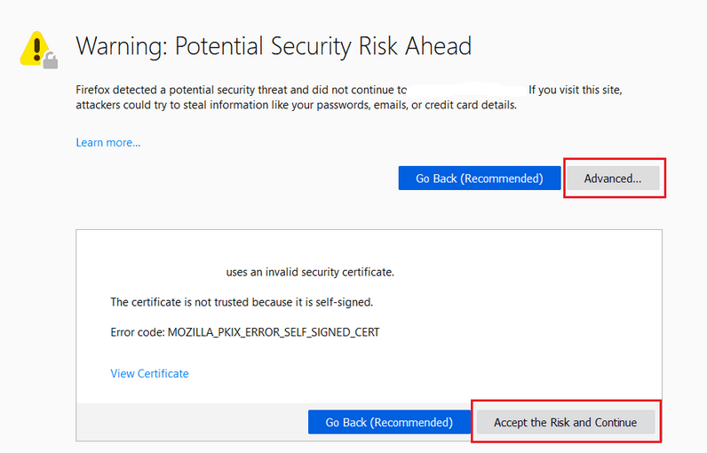

# ContosoTraders: Running Locally

1. Follow the [deployment instructions](./deployment-instructions.md) to provision the infrastructure in your own Azure subscription.

2. Ensure that you have the following installed on your local machine:
   * [Git](https://git-scm.com/downloads)
   * [Node LTS v18.15.0](https://nodejs.org/dist/v18.15.0/)
   * [DOTNET 7 SDK](https://dotnet.microsoft.com/en-us/download/dotnet/7.0)
   * [AZ CLI](https://learn.microsoft.com/en-us/cli/azure/install-azure-cli)

3. Login to AZ CLI using the details of the [service principal previously created](./deployment-instructions.md):
   * `az login --service-principal -u <clientId> -p <clientSecret> --tenant <tenantId>`

4. Git clone your forked repository to your local machine.
   * `git clone <FORKED-REPO-URL> <PATH-TO-A-LOCAL-FOLDER>`

5. Run the Products API locally:
   * Open a cmd window and navigate to the `src/ContosoTraders.Api.Products` folder.
   * Run `dotnet user-secrets set "KeyVaultEndpoint" "https://contosotraderskv<SUFFIX>.vault.azure.net/"`. Replace `<SUFFIX>` with the [value used in the github repository variable](./deployment-instructions.md#prepare-your-github-account).
   * Run `dotnet build && dotnet run`. This will start the web API at `https://localhost:62300/swagger`.
   * Note that your browser may show you a warning about insecure connection which you can safely ignore.
      

6. Run the Carts API locally:
   * Open a cmd window and navigate to the `src/ContosoTraders.Api.Carts` folder.
   * Run `dotnet user-secrets set "KeyVaultEndpoint" "https://contosotraderskv<SUFFIX>.vault.azure.net/"`. Replace `<SUFFIX>` with the [value used in the github repository variable](./deployment-instructions.md#prepare-your-github-account).
   * Run `dotnet build && dotnet run`. This will start the web API at `https://localhost:62400/swagger`.
   * Note that your browser may show you a warning about insecure connection which you can safely ignore.

7. Run the UI locally:
   * Open a cmd window and navigate to the `src/ContosoTraders.Ui.Website` folder.
   * Run `npm install`.
   * Set the following environment variables:
     * `set REACT_APP_APIURL=https://localhost:62300/v1`
     * `set REACT_APP_APIURLSHOPPINGCART=https://localhost:62400/v1`
     * `set REACT_APP_BASEURLFORPLAYWRIGHTTESTING=http://localhost:3000` (note: This endpoint is `http://` and NOT `https://`)
     * `set REACT_APP_B2CCLIENTID=<B2C-CLIENT-ID>` (note: This step is optional. Replace `<B2C-CLIENT-ID>` with the output of the command: `az ad app list --display-name contoso-traders-cloud-testing-app<SUFFIX> --query "[].appId" -o tsv`)
   * Run `npm run start`. This will start the UI on `http://localhost:3000`.
   * Note that your browser may show you a warning about insecure connection which you can safely ignore.

8. Run the Playwright UI tests locally:
   * Ensure that you have executed step #7 above and launched the UI locally.
   * Open a cmd window and navigate to the `src/ContosoTraders.Ui.Website` folder.
   * Run `npx playwright install --with-deps`.
   * Run `npx playwright test`.
   * The Playwright UI tests will run for a few minutes and a HTML report will be displayed at the end.
